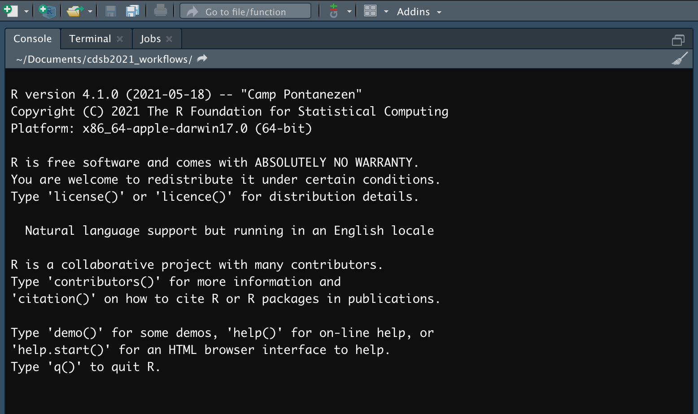
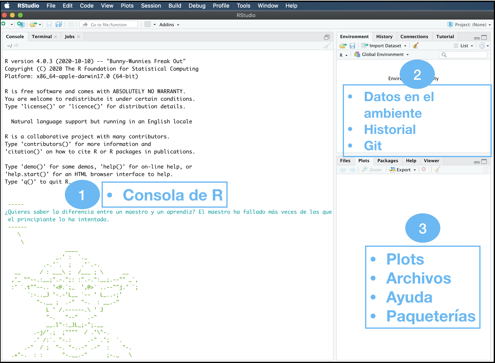
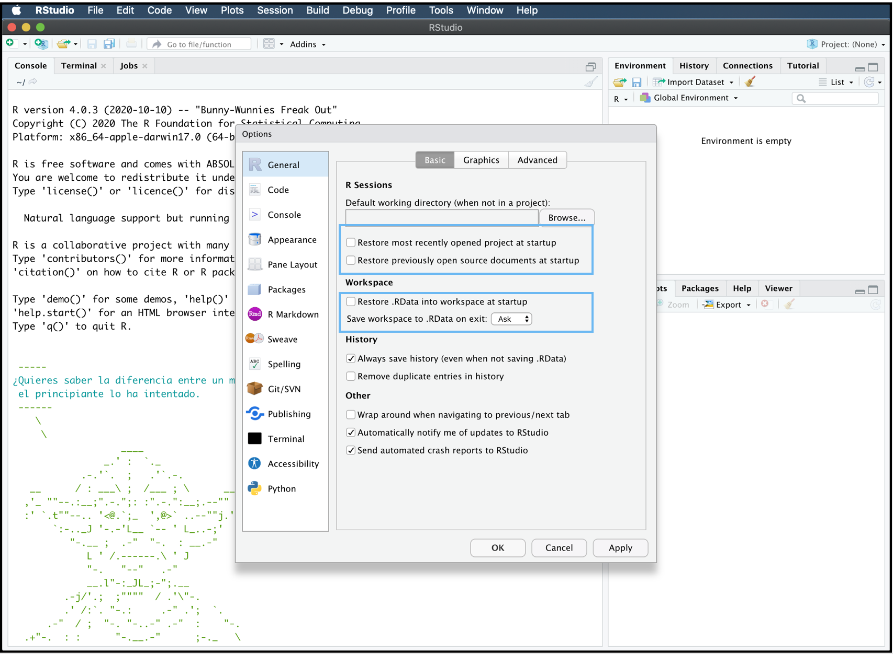
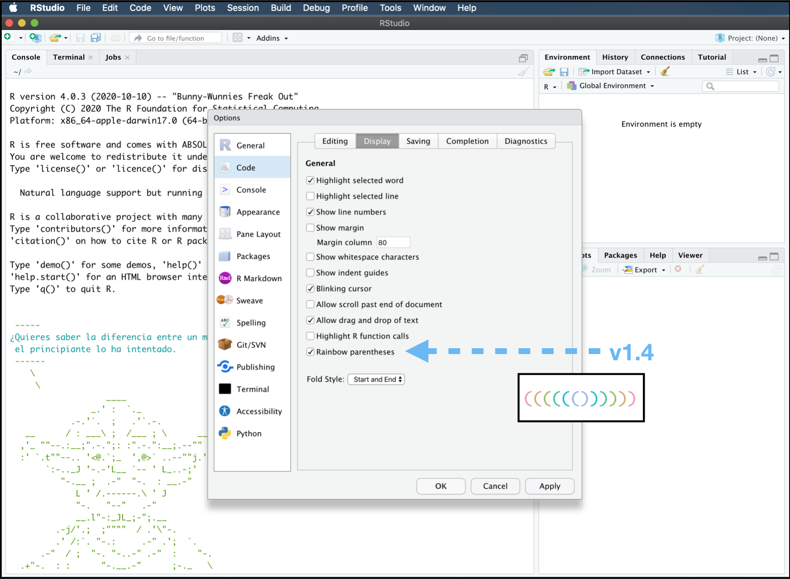
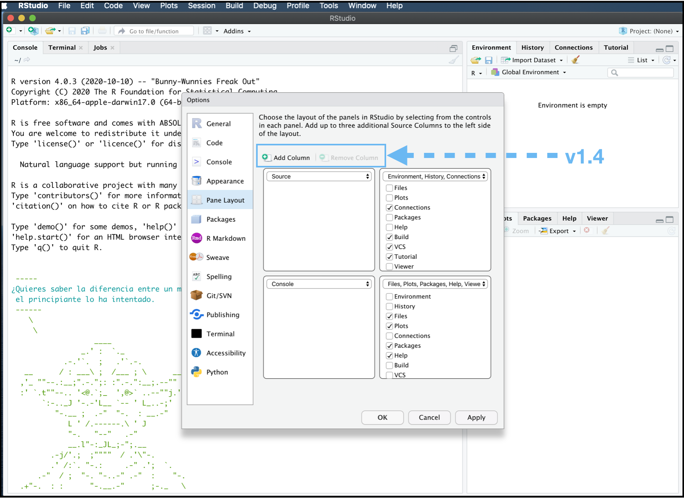

# RStudio hacks

Erick Cuevas Fernández

9 de agosto de 2021

## Inicio

Para poder usar RStudio tenemos que tener instalado R en nuestras máquinas. Si aún no lo has instalado lo puedes descargar desde el siguiente link <https://cran.itam.mx>. Asegúrate de tener la versión más reciente.

También necesitas descargar la versión más reciente de [RStudio Desktop](https://www.rstudio.com/products/rstudio/download/). (*1.4.1717*).

## Misión de RStudio

*"La misión de RStudio es crear software gratuito y de código abierto para ciencia de datos, investigación científica y comunicación técnica. Hacemos esto para mejorar la producción y el consumo de conocimiento por parte de todos, independientemente de los medios económicos, y para facilitar la colaboración y la investigación reproducible, las cuales son críticas"*

## Equipo de RStudio

*"Las personas que se han unido a RStudio en este viaje son extraordinarias. Incluyen un número excepcional de los científicos de datos y desarrolladores de software de código abierto más productivos y respetados del mundo."*

...

## Historia de RStudio

```{r,echo=FALSE, out.width='80%', fig.align='center'}
knitr::include_graphics("img/timeline_rstudio.png")
```

## Primeros consejos para iniciar

Al abrir RStudio la consola nos arroja el mensaje que se muestra a continuación en la imagen. En este mensaje nos indica la versión de R que tenemos instalada y la plataforma en la que estamos trabajando. Para citar R en alguna publicación basta con usar la función `citation()`. Y para conocer a todo el equipo detrás del desarrollo de R, puedes consultarlo con la función `contributors()`. R y RStudio están diseñados para que muchas personas puedan aprenderlo desde cero, con tan solo este primer mensaje todo usuario podría empezar a aprender R; para empezar a aprender R intenta usar la función en tu consola de `help.start()` con el cual se desplegará un menú en *HTML* con todos los manuales para aprender a usar R, también aparecerán los manuales de todas las paqueterías del repositorio de **CRAN** (*The Comprehensive R archive Network*) así como enlaces a noticias del mundo de R.

```{r,echo=FALSE, out.width='80%', fig.align='center'}

```

Otro consejo útil al momento de iniciar con el uso de una paquetería o función en particular es ejecutar la función `demo()`. Esta función se puede utilizar con los siguientes argumentos.

```{r, eval=FALSE, message=FALSE, warning=FALSE}
demo(topic, package = NULL, lib.loc = NULL,
     character.only = FALSE, verbose = getOption("verbose"),
     echo = TRUE, ask = getOption("demo.ask"),
     encoding = getOption("encoding"))
```

Para desplegar todos las *demostraciones* disponibles ejecuta la función como se muestra a continuación:

```{r, eval=FALSE, message=FALSE, warning=FALSE}
demo(package = .packages(all.available = TRUE))
```

## La interfaz gráfica de RStudio

RStudio es un *entorno de desarrollo integrado* (IDE) para R. Su interfaz gráfica incluye 3 paneles principales:

1.  Consola de R
2.  Datos en el ambiente, Historial, Conecciones remotas, Git.
3.  Gráficos, Archivos, Ayuda, Paqueterías.

```{r,echo=FALSE, out.width='80%', fig.align='center'}

```

### Opciones Globales...

Las **opciones globales** (Global Options...) nos permitirán cambiar aspectos visuales de la organización de la interfaz gráfica. Para acceder a estas opciones debemos ir a `Tools` \| `Global Options...` o usar directamente el atajo de teclado `command` + `,` (Mac) ó `ctrl` + `,` (Linux y Windows).

Una vez accesando a las **Opciones Globales** podemos modificar que no se gaste memoria temporal al guardar datos o código de sesiones anteriores en la parte de `General`. Al quitar las "palomitas" de los pequeños cuadros de las opciones generales señaladas en los recuadros azules.

```{r,echo=FALSE, out.width='80%', fig.align='center'}

```

Dentro de las **Opciones Globales** podemos modificar nuestros atajos de teclado, el tamaño de la indentación, margenes de código, etc, etc. Una función atractivamente visual al momento de escribir código, sobre todo en funciones y para hacer sub conjuntos de nuestros datos, es **Parentesis de Arcoíris**. Esta es una nueva función en esta nueva versión de RStudio. Para habilitarla debemos dentro de las **Opciones Globales** debemos acceder a `Code` \| `Display` y marcar la "palomita" en `Rainbow parentheses`.

```{r,echo=FALSE, out.width='80%', fig.align='center'}

```

En la se sección de **Apariencia**, esta opción podemos definir el color, letra y tamaño de nuestro editor de código. De esta manera personalizarlo a nuestras necesidades o gustos. También podemos modificar el diseño de los paneles en **Pane Layout**, en la nueva versión de RStudio podemos visualizar dos editores de código al mismo tiempo. Al hcer click en `Add column`. En esta sección podemos modificar la distribución de los paneles y el contenido de ellos.

```{r,echo=FALSE, out.width='80%', fig.align='center'}

```

### Actividad

-   Realiza los cambios necesarios en tus **Opciones Globales** para que no se guarde el proyecto más reciente ni los datos en el ambiente de RStudio, así como la .RData

-   Habilita los paréntesis de arcoíris.

-   Cambia el tema de tu RStudio al de **Dracula** y usa la letra y el tamaño que más prefieras.

## Atajos con el teclado en RStudio

**NOTA**: en windows en vez de `command` usa `control`

-   `%>%` : `command` + `Shift` + `m`\
-   Para comentar código: `command` + `Shift` + `c`
-   Expandir cursor: mantén presionado `Alt` + usa el cursor
-   Ejecutar en la terminal líena de código y saltar a la siguiente línea de código: `command` + `Enter`
-   Ejecutar en la terminal línea de código y mantenerse en la línea de código: `Alt` + `Enter`
-   Compilar en reporte pdf: `Shift` + `command` + `k`

## Archivos de RStudio

En RStudio podemos generar todos los archivos enlístados en "New File". El archivo más usado para desarrollar código en R es **"R Script"**. Aún así RStudio nos permite hacer reportes de nuestros código con **"R Notebook y R Markdown"**, aplicaciones web con **"Shiny Web App"**, generar APIs con "Plumber API", editar código en HTML, C, C++, Python, CSS, JavaScript, Shell, entre otros. Más adelante verás cómo optimizar tu trabajo trabajando con RProject en RStudio.

## Trabajando con el **Environment**

### Actividad

-   Crea dos **R scripts**. Agrega una nueva columna en la visualización de los *Scripts* dentro de **Opciones Globales**.

-   En un **script** ejecuta el siguiente código:

```{r, eval=FALSE}
install.packages("MASS")

library(MASS)

data(cats)
View(cats)

table(cats$Sex)

```

**PAUSA**

¿Qué sucede al ejecutar `data(cats)` y `View(cats)`?

¿Qué formas hay desde la interfaz gráfica para importar datos?

-   En el otro **script** ejecuta el siguiente código:

```{r, eval=FALSE}
install.packages("ggplot2")
library(ggplot2)

ggplot(cats, aes(x = Sex)) + 
    geom_bar(fill = "orange", color = "black") + theme_classic() 

```

**PAUSA**

¿Cómo podemos exportar el gráfico?

## Últimos tips

Puedes modificar el zoom de cada panel en RStudio según tus necesidades y preferencias.

-   **Lupa**

-   **Várita mágica**

-   **Addins**

-   **Help**

-   **RMarkdown**

### Actividad

Ejecuta el siguiente código

```{r eval=FALSE}
install.packages("ggThemeAssist")

g <- ggplot(cats, aes(x = Sex)) + 
    geom_bar(fill = "orange", color = "black") + theme_classic() +
    xlab("Sexo") + ylab("Número de Gatos") + ggtitle("Gatos")

g
```

A continuación selecciona `g`, ve a `Addins` y da click en `ggplot Theme Assistant`
