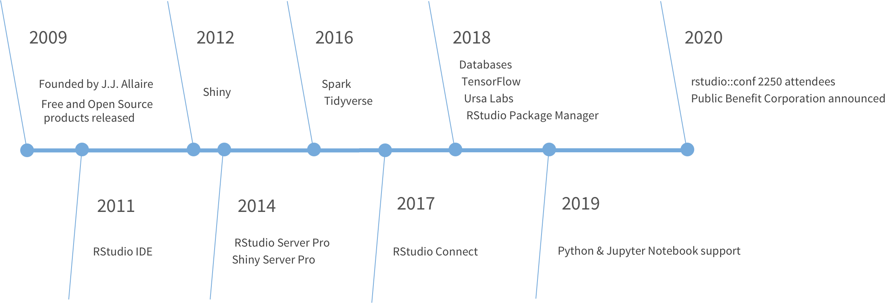

# RStudio hacks

Erick Cuevas Fernández

9 de agosto de 2021

## Diapositivas


## Misión de RStudio

*"La misión de RStudio es crear software gratuito y de código abierto para ciencia de datos, investigación científica y comunicación técnica. Hacemos esto para mejorar la producción y el consumo de conocimiento por parte de todos, independientemente de los medios económicos, y para facilitar la colaboración y la investigación reproducible, las cuales son críticas"*

## Equipo de RStudio

*"Las personas que se han unido a RStudio en este viaje son extraordinarias. Incluyen un número excepcional de los científicos de datos y desarrolladores de software de código abierto más productivos y respetados del mundo."*

## Historia de RStudio 

```{r,echo=FALSE, out.width='80%', fig.align='center'}

```


## Primeros consejos para iniciar

Al abrir RStudio la consola nos arroja el mensaje que se muestra a continuación en la imagen. En este mensaje nos indica la versión de R que tenemos instalada y la plataforma en la que estamos trabajando. Para citar R en alguna publicación basta con usar la función `citation()`. Y para conocer a todo el equipo detrás del desarrollo de R, puedes consultarlo con la función `contributors()`. 
R y RStudio están diseñados para que muchas personas puedan aprenderlo desde cero, con tan solo este primer mensaje todo usuario podría empezar a aprender R; para empezar a aprender R intenta usar la función en tu consola de `help.start()` con el cual se desplegará un menú en *HTML* con todos los manuales para aprender a usar R, también aparecerán los manuales de todas las paqueterías del repositorio de **CRAN** (*The Comprehensive R archive Network*) así como enlaces a noticias del mundo de R.  

```{r,echo=FALSE, out.width='80%', fig.align='center'}
knitr::include_graphics("img/iniciors_1.png")
```

Otro consejo útil al momento de iniciar con el uso de una paquetería o función en particular es ejecutar la función `demo()`. Esta función se puede utilizar con los siguientes argumentos. 

```{r, eval=FALSE, message=FALSE, warning=FALSE}
demo(topic, package = NULL, lib.loc = NULL,
     character.only = FALSE, verbose = getOption("verbose"),
     echo = TRUE, ask = getOption("demo.ask"),
     encoding = getOption("encoding"))
```

Para desplegar todos las *demostraciones* disponibles ejecuta la función como se muestra a continuación: 

```{r, eval=FALSE, message=FALSE, warning=FALSE}
demo(package = .packages(all.available = TRUE))
```


### La interfaz gráfica de RStudio

RStudio es un *entorno de desarrollo integrado* (IDE) para R. Su interfaz gráfica incluye 4 paneles principales. 
