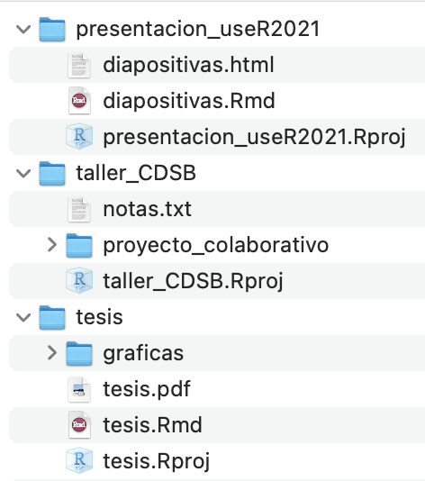

# Flujos de trabajo con proyectos de RStudio

Joselyn Chávez

9 de agosto de 2021

<style>
div.grey { 
background-color: #bfbfbf;
}
</style>

<style>
div.center {
text-align:center;
}
</style>

## Diapositivas

[
```{r, echo=FALSE}
knitr::include_url("https://comunidadbioinfo.github.io/cdsb2021_workflows/dia1_sesion2.html",
  height = "380px")
```
](https://comunidadbioinfo.github.io/cdsb2021_workflows/dia1_sesion2.html)

## ¿Qué es un proyecto de RStudio?


- Es un archivo especial de R, compatible con RStudio, que al ejecutarlo hará 3 cosas:

  - Abrirá una nueva sesión de RStudio.
  - Establecerá la ubicación del proyecto como tu directorio de trabajo.
  - Establecerá la ubicación del proyecto como la raíz de los archivos.

## ¿Cómo generamos un proyecto de RStudio?

### Opción 1: Creando un proyecto en un directorio nuevo.

  - En las opciones de RStudio Ve a File > New project > New Directory > New Project.
  - Asigna un nombre a tu proyecto, sin espacios y sin caracteres especiales.
  - Selecciona la ubicación donde crearás el nuevo directorio.
  - Selecciona la opción Open in New Session.
  - Oprime Create Project.

<div class = "grey color">
<div class = "center">**Actividad 1**</div>

Genera un proyecto de RStudio llamado 'nuevodirectorio' en un directorio nuevo en tus Documentos (~/Documentos). 
</div>

### Opción 2: Creando un proyecto en un directorio existente.
  
  - Crea un directorio en alguna ubicación conocida de tu computadora.
  - Asigna un nombre a tu directorio, sin espacios y sin caracteres especiales (Este será el nombre de tu proyecto).
  - En las opciones de RStudio ve a File > New project > Existing Directory.
  - Selecciona la ubicación donde previamente creaste el directorio.
  - Selecciona la opción Open in New Session.
  - Oprime Create Project.

<div class = "grey color">
<div class = "center">**Actividad 2**</div>

Genera una carpeta o directorio llamado 'directorioprevio' en tus Documentos (~/Documentos), después genera un proyecto de RStudio usando este folder como base. 
</div>

## ¿Por qué usar proyectos de RStudio?

- Te permiten ser más organizado y pasar de tener una ensalada de archivos a tener carpetas para cada sección del análisis.


```{r,echo=FALSE, fig.align='center', out.width='60%'}
library(cowplot)
ggdraw() + 
  draw_image("img/salad.png", width = 0.4) + 
  draw_image("img/filesorder.png", width = 0.5, x = 0.5)
```


- Compartamentalizas tu trabajo al generar un proyecto específico para cada análisis.

```{r,echo=FALSE, out.width='35%', fig.align='center'}

```

- Te permiten trabajar con varios proyectos a la vez en sesiones independientes de RStudio, cada uno con sus propias variables, directorio de trabajo y archivos.

```{r,echo=FALSE, out.width='80%', fig.align='center'}

```

- Establece automáticamente tu directorio de trabajo. En lugar de usar setwd() solamente requieres ejecutar el archivo .Rproj para abrir la sesión y trabajar en la ubicación del proyecto.

- Puedes usar rutas relativas (y estables) a tus archivos, que seguirán funcionando sin importar en dónde se ubique tu proyecto.

- Facilita el compartir y reproducir tu trabajo. No más rutas al estilo ~/MiComputadora/MiFolder/MiArchivo. Comparte la carpeta completa de tu proyecto con todos los archivos necesarios y usa rutas relativas dentro del Rscript, por ejemplo ./datos.

- Nos ayuda a establecer colaboraciones y trabajar con plataformas de control de versiones.

```{r,echo=FALSE, fig.align='center', out.width='40%'}
#library(cowplot)
ggdraw() + 
  draw_image("img/GitHubLogo.png", width = 0.6) + 
  draw_image("img/gitlablogo.jpg", width = 0.5, x = 0.5)
```


<div class = "grey color">
<div class = "center">**Actividad 3**</div>

Comprueba algunas ventajas de usar proyectos de RStudio.

- Genera un nuevo proyecto de RStudio llamado 'miproyecto', recuerda que existen varias formas para hacerlo. 
- Cierra la sesión y vuelve a abrirla ejecutando desde la terminal open miproyecto.Rproj o dando doble click sobre el archivo miproyecto.Rproj.
- Evalúa tu directorio de trabajo ejecutando en la consola de RStudio el comando getwd().
- Cierra la sesión y mueve toda la carpeta de tu proyecto a otra ubicación. Si lo creaste en Documentos mueve la carpeta al Escritorio o viceversa.
- Abre nuevamente el proyecto y verifica el directorio de trabajo, ¿Cambió el directorio de trabajo?
- Sin cerrar este proyecto, abre alguno de los proyectos que generaste previamente (por ejemplo directorioprevio.Rproj), recuerda que puedes seleccionar Open Project in New session
</div>


## Algunos hacks!

- RStudio recuerda los proyectos con los que has trabajado recientemente. Ve a la esquina superior derecha y da click en la flecha junto al nombre de tu proyecto actual. Verás todos los proyectos recientes. Si das click en el nombre de alguno de ellos te abrirá el proyecto en la misma sesión, si das click en el recuadro con flecha blanca te abrirá una nueva sesión con tu proyecto.

```{r,echo=FALSE, out.width='30%', fig.align='center'}

```

- Crea todos tus proyectos dentro de una carpeta principal y usa el buscador de archivos para acceder a ellos rápidamente.

```{r,echo=FALSE, fig.align='center'}
ggdraw() + 
  draw_image("img/misproyectos.png", width = 0.4) + 
  draw_image("img/resultadomisproyectos.png", width = 0.5, x = 0.5)
```


