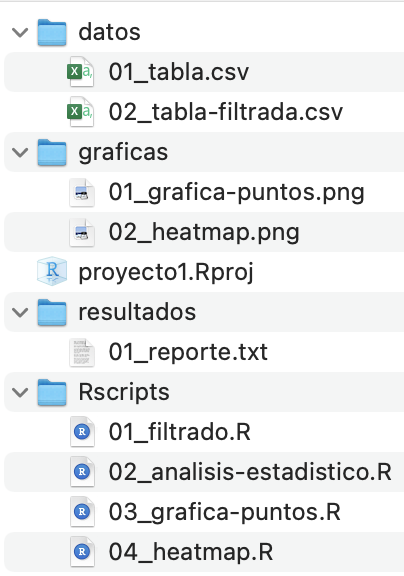

# Generando mi primer proyecto de RStudio

Joselyn Chávez

9 de agosto de 2021

<style>
div.grey { 
background-color: #bfbfbf;
}
</style>

<style>
div.center {
text-align: center;
}
</style>

## Diapositivas

[
```{r, echo=FALSE}
knitr::include_url("https://comunidadbioinfo.github.io/cdsb2021_workflows/dia1_sesion3.html",
  height = "380px")
```
](https://comunidadbioinfo.github.io/cdsb2021_workflows/dia1_sesion3.html)

## Buenas prácticas para ordenar tu proyecto

Genera carpetas con:

- Entradas (datos originales y datos filtrados).
- Procedimientos (Rscripts con el filtrado, manejo de datos, análisis, generación de gráficas).
- Salidas (Gráficas generadas y resultados).

```{r, echo=FALSE, out.width='35%', fig.align='center'}

```

<div class = "grey color">
<div class = "center">**Actividad 1**</div>

Descarga la carpeta **proyecto_desordenado** desde https://bit.ly/cdsb2021_workflows y ordena los archivos en subcarpetas, considera las recomendaciones mencionadas anteriormente.
</div>

## Utiliza las rutas adecuadas a los archivos

Ahora que has reorganizado tu proyecto, debes usar las rutas relativas para importar y exportar tus archivos en sus directorios correspondientes.

Recuerda que la raiz de tu proyecto será el directorio principal.

Por ejemplo:

```{r,echo=FALSE,out.width='30%',fig.align='center'}

```

```{r, eval=FALSE}
tb <- read.table("datos/mis_datos.txt", header = TRUE)
```

<div class = "grey color">
<div class = "center">**Actividad 2**</div>

- Con tu proyecto ordenado, abre el archivo analisis.R y corrige las rutas a los archivos considerando los subdirectorios que creaste. 
- Mejora aún más tu proyecto! Secciona tu código y crea nuevos scripts con cada una de las secciones que detectes en el análisis.
</div>

## Compartiendo tus proyectos

Una de las ventajas de usar proyectos de RStudio es facilitar la colaboración con otras personas, así como compartir tu código de manera reproducible.

Lo más común es utilizar control de versiones, por ejemplo en GitHub o GitLab. Pero comencemos compartiendo nuestro proyecto mediante Drive. 

<div class = "grey color">
<div class = "center">**Actividad 3**</div>

Genera un proyecto en tu computadora que contenga lo siguiente: 

- Un Rscript o Rmd con un pequeño análisis usando datos públicos de R, por ejemplo puedes usar los datos [palmperpinguins](https://allisonhorst.github.io/palmerpenguins/), [gapminder](https://cran.r-project.org/web/packages/gapminder/README.html), o los conjuntos de datos en español del paquete [datos](https://github.com/cienciadedatos/datos).  
- Genera al menos un archivo de salida, por ejemplo una gráfica, una tabla, un archivo de texto o un html relacionado con tu análisis. 
- Crea los subdirectorios necesarios para ordernar tu proyecto y verifica que tu Rscript o Rmd contenga las rutas necesarias para leer o escribir estos archivos en las subcarpetas. 
- Intercambien proyectos! Carga tu proyecto completo en el Drive https://bit.ly/cdsb2021_workflows y pídele a tu compañera/o que lo descargue y compruebe que puede ejecutar el análisis en su computadora.

</div>

