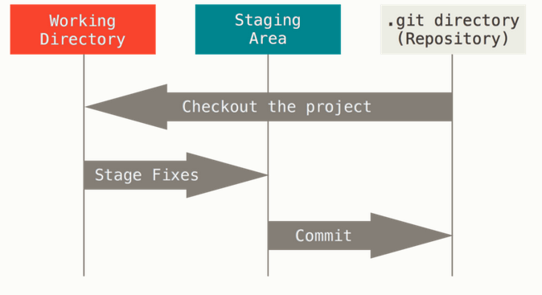

# Introducción a Git y GitHub desde terminal

Mirna Vázquez Rosas-Landa

10 de agosto de 2021

##  ¿Qué es git?

[Git](https://git-scm.com) es un software libre que funciona como un sistema de control de versiones, creado en el año 2005 por Linus Torvalds, el creador de Linux (Un poco mas sobre la historia [aquí](https://git-scm.com/book/en/v2/Getting-Started-A-Short-History-of-Git)).

[GitHub](https://github.com) es un espacio donde los desarrolladores pueden guardar su código y compartirlo con el resto del mundo usando el sistema de control de versiones de git.

Con **git** podemos regresar a versiones anteriores de los proyectos, revisar cambios y crear ramas experimentales para probar código sin dañar el código principal.

```{r,echo=FALSE, out.width='80%', fig.align='center', fig.cap="Control de versiones de git. La rama principal se llama master y puedes tener otras ramas como la rama de desarrollo."}

```

## Instalación y configuración.

Git se puede utilizar en todos los sistemas operativos. Aquí hay algunas opciones de como instalar git en tu sistema:

- https://git-scm.com/book/es/v2/Inicio---Sobre-el-Control-de-Versiones-Instalaci%C3%B3n-de-Git
- https://git-scm.com/downloads
- https://github.com/git-guides/install-git
- https://gitforwindows.org/

Después de instalar git localmente puedes crear una cuenta en GitHub.

- https://github.com/

### Configurando mi cuenta

El comando **git config** es utilizado para el proceso de configuración. Con este comando podemos configurar nuestra identidad, el editor de textos que queremos utilizar, entre otras cosas. Todo esto lo podemos hacer para todos los usuarios del sistema, para un solo usuario o para un solo repositorio. Los datos que demos en este comando quedarán asociados a los comentarios que hagamos

```{bash, eval=FALSE}
git config
```

Configura tu username

```{bash, eval=FALSE}
git config --global user.name "Mi Nombre"
```

Configura tu correo electrónico

```{bash, eval=FALSE}
git config --global user.email "correo@electronico.com"
```

Explora tu configuración

```{bash, eval=FALSE}
less ~/.gitconfig
```

## Mi primer repositorio

El primer comando que tenemos que ejecutar es **git init.**

Utiliza el siguiente comando y discute que hace **git init**. Correlo antes y después de que escribas **git init**.

```{bash, eval=FALSE}
ls  -d .*
```

Vamos a ver qué está pasando.

```{bash, eval=FALSE}
git status
```

Utiliza **git branch** para cambiar el nombre de la rama y corrobora con **git status.**

## Interactuar con GitHub desde la terminal

Vamos a clonar un repositorio.

```{bash, eval=FALSE}
git clone https://github.com/mirnavazquez/taller_git.git
```

Explora el repositorio y copia el archivo del genoma a una nueva carpeta, descomprimelo, e inicia un repositorio. ¿Que pasa si haces un **git status**?.

### Secciones de un proyecto de git


```{r,echo=FALSE, out.width='80%', fig.align='center', fig.cap="Secciones de un proyecto de git."}

```

Puedes revisar más información aquí: https://git-scm.com/book/es/v2/Inicio---Sobre-el-Control-de-Versiones-Fundamentos-de-Git

