# Generando un proyecto colaborativo con Git/GitHub

Aurora Labastida

10 de agosto de 2021

<style>

div.color { 
border-radius: 5px; 
padding: 20px;
margin: 30px 0px 30px;}

div.cyan { background-color:#00cccc; }

div.orange{ background-color:#e6dbcf;}

div.pair { 	
display: flex;
flex-direction: row;
justify-content: center;
text-align:center;
padding:0px}

div.inside { width: 49%; padding: 0px}

div.scroll { 
max-height: 400px; 
overflow-y: auto; 
background: #111111;
border-radius:5px;
padding: 10px;
margin: 30px 0px 30px;
color: #999999;}

div.alert{color:#0D4848; background-color:transparent}
</style>

<div class="alert">**Para participar en los ejercicios en equipo de esta sesión danos por favor tu nombre de usuario de GitHub**:

[Registro de usuarios de GitHub](https://docs.google.com/forms/d/e/1FAIpQLScWW9qW0926tf3xqEkq9EBpjqJ-8k3Rj44W5P3lARshnvjM3A/viewform)
</div> 


## Colaborando mediante Git y Git Hub

Git y GitHub son muy útiles para la colaboración, pues permiten compartir copias de los proyectos (repositorios) y mantenerlas sincronizadas entre sí. Además, Git y GitHub registran los cambios hechos por cada colaborador y evitan que un programador sobrescriba sobre los cambios de otro.

Ensayaremos algunos principios de la colaboración con Git y GitHub mediante una serie de ejercicios.


## Inicio del proyecto

<div class = "cyan color">
A ti y a un colaborador les interesa la anatomía de gatos. Deciden colaborar para averiguar si hay diferencias significativas en el peso del cuerpo y del corazón entre gatos hembras y machos.

Uno de ustedes iniciará el análisis del cuerpo (**equipo** ***body***) y el otro el análisis del corazón (**equipo** ***heart***). Para saber en qué equipo estás:

[Da click aquí](https://docs.google.com/spreadsheets/d/17erK-35KV2NYD55XlgzW09_1wb7ZSyIRp5bUiOeUsXk/edit?usp=sharing)

</div>

A) Ve a **GitHub** y usando tu cuenta crea un nuevo repositorio.

  - **Equipo** ***body***: el nombre de tu repositorio será ***body***

  - **Equipo** ***heart***: el nombre tu repositorio será ***heart***

B) Incluye un README.md y una descripción.

C) En tu computadora utiliza la **terminal** para crear una **copia local** del repositorio ( [Obtén el link a tu repositorio](https://docs.google.com/spreadsheets/d/1Kx0bI-u5aE2xXp5TaiyRQmRTjgxG5qykqh4ie9qOtyU/edit?usp=sharing) )

- **Equipo** ***body***
```{bash eval=FALSE}
	git clone https://github.com/mi_usuario/body
    ```

- **Equipo** ***heart***
```{bash eval=FALSE, paged.print=TRUE}
    git clone https://github.com/mi_usuario/heart
    ```

___

**Nota** 
En el contexto de esta clase **terminal** se refiere al entorno de línea de comandos de tu sistema operativo (alguna distribución de Linux o macOS) y **GitHub** se refiere al sitio web de GitHub (https://github.com/) o de tu cuenta de GitHub.

___

D) Abre **RStudio** y cambia la ruta de trabajo a la de tu repositorio. Para ello usa a **setwd** (en la consola de RStudio) o el menú de RStudio (ve a Session > Choose working directory > Choose directory...).

E) Añade un primer *script* de R para analizar los datos del cuerpo o del corazón de gatos. Para ello usa el menú de RStudio (ve a File > New File > R Script).


- *Equipo* ***body***: el nombre del *script* será body.R

- *Equipo* ***heart***: el nombre del *script* será heart.R

<div class="orange color">
Usaremos el set de datos ***cats***, incluído en el paquete **MASS**. En él se listan el **sexo (Sex)**, **peso corporal (Bwt)** y **peso del corazón (Hwt)** de varios gatos.
```{r eval=TRUE, paged.print=TRUE}

library("MASS")

head(cats,3)
```

Con la función **str** se observa que se incluyen tanto **Hembras (F)** como **machos (M)**.
```{r eval=TRUE, paged.print=TRUE}

str(cats)
```
</div>

F) Contenido del *script* (ambos equipos)
```{r eval=FALSE, paged.print=TRUE}
		library("MASS")

		# Datos a analizar

        head(cats)
        
		summary(cats)
    ```

G) Guarda el *script* con el nombre antes mencionado.

---

Ahora cuentas con un repositorio en GitHub y con una copia local de dicho repositorio. El repositorio local está configurado para enviar cambios y recibir cambios desde el repositorio original u ***origin***, es decir, el repositorio en GitHub.

```{r, echo=FALSE, out.width='60%', fig.align='center'}
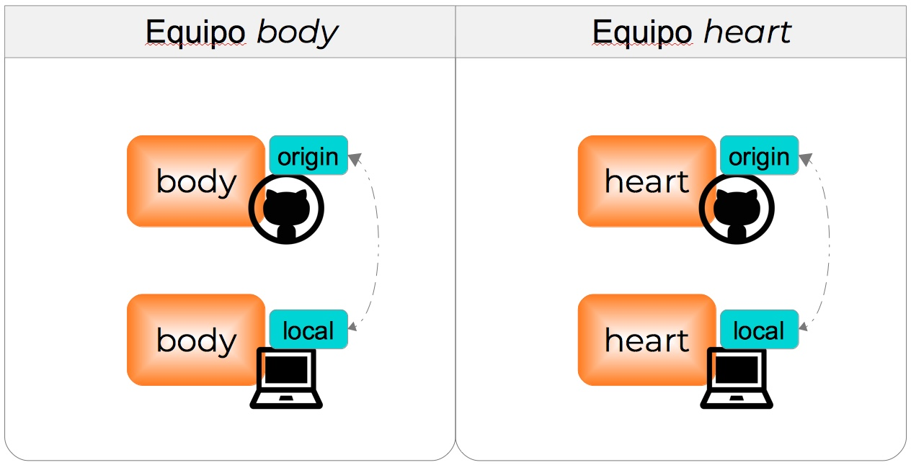
```

---

H) En la terminal ve a tu repositorio y comparte los cambios con GitHub:

  - Revisa si hay cambios en el arbol de trabajo
```{bash, eval=FALSE, engine="sh"}
git status
```

  - Añade los cambios al siguiente *commit*.
```{bash, eval=FALSE,engine="sh"}
git add *
```

  - Realiza el *commit* añadiendo un mensaje.
```{bash, eval=FALSE,engine="sh"}
git commit -m "primer script"
```

  - Enviamos los cambios al GitHub, es decir, al repositorio ***origin***
```{bash, eval=FALSE, engine="sh"}
git push
`````


## Inicio de la colaboración

<div class = "cyan color">

Estamos trabajando en nuestro repositorio cuando nuestro colaborador nos pide que ayuda para su proyecto, que también tiene un repositorio de GitHub. 

Identifica el usuario de GitHub de tu colaborador. Si eres del equipo ***heart*** tu ***colaborador es del equipo body*** y si eres del equipo ***body*** tu ***colaborador es del equipo heart***.

[Link al repositorio de tu colaborador](https://docs.google.com/spreadsheets/d/1Kx0bI-u5aE2xXp5TaiyRQmRTjgxG5qykqh4ie9qOtyU/edit?usp=sharing)

</div>


Un ***fork*** de GitHub es una copia del repositorio de un colaborador que podemos administrar en forma independiente. Podemos actualizar el *fork* con los nuevos cambios del colaborador y sugerir cambios desde nuestro *fork* a su repositorio.


A) Ve al repositorio de tu colaborador en GitHub

    - Si estás en el **equipo** ***body***
    
    https://github.com/**colaborador**/**heart**

    - Si estás en el **equipo** ***heart***
    
    https://github.com/**colaborador**/**body**
    
B) Realiza un ***fork*** del repositorio de tu colaborador

```{r, echo=FALSE, out.width='80%', fig.align='center', fig.cap='**Nota**: si eres del equipo *heart* el nombre del repositorio será *body*'}
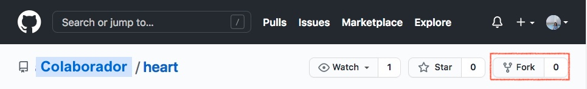
```

    
## Actualizar un *fork* desde el repositorio *upstream*

<div class = "cyan color">

Tu colaborador realizó un ***fork*** de tu repositorio para apoyarte en el análisis estadístico. Ahora tú sigues añadiendo cambios en tu repositorio. Así pues el *fork* que creó tu colaborador se irá quedando momentaneamente atrás de tu repositorio.

</div>

A) Usando a RStudio añade nuevos cambios a tu repositorio original.

- Si eres del equipo *body* añade al *script* body.R:
```{r eval=FALSE, paged.print=TRUE}
# Estadísticas del cuerpo por sexo

tapply(cats$Bwt,cats$Sex,summary)
```    
- Si eres del equipo *heart* añade al *script* heart.R
```{r eval=FALSE, paged.print=TRUE}
# Estadísticas del corazon por sexo

tapply(cats$Hwt,cats$Sex,summary)
```

B) Ve a la terminal y envía los cambios a GitHub.

<div class = "orange color">

**Nota sobre el análisis:**

Ejecuta el *script* body.R o heart.R. El test estadístico t sugiere que el peso promedio del cuerpo y del corazón es significativamente distinto entre gatos hembras y machos.

</div>

<div class = "cyan color">

Realizaste el ***fork*** del repositorio de tu colaborador para apoyarlo en el análisis estadístico. Después de ello tu colaborador siguió añadiendo cambios en su repositorio por lo que decides actualizar tu *fork* con sus cambios.

</div>


C) Ve al *fork* que creaste en GitHub ( [Link al fork](https://docs.google.com/spreadsheets/d/1Kx0bI-u5aE2xXp5TaiyRQmRTjgxG5qykqh4ie9qOtyU/edit?usp=sharing) ). GitHub te indica que el *fork* se encuentra detrás del repositorio de tu colaborador. Actualízalo con la opción ***Fetch upstream***.


```{r, echo=FALSE, out.width='80%', fig.align='center', fig.cap='***Nota***: Si estás en el equipo *heart* el *fork* se llamará *body*'}
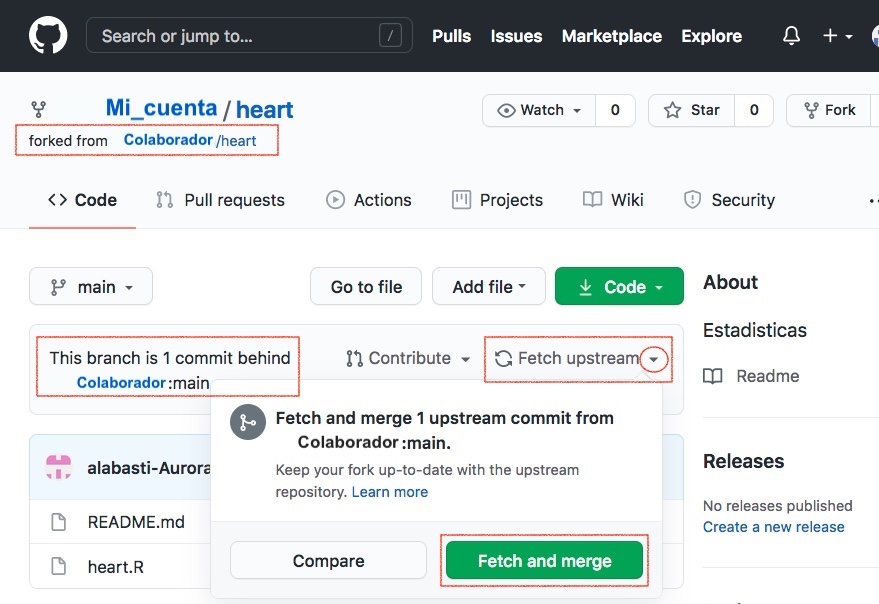
```


### Sincronización desde la terminal

<div class = "cyan color">

Sigues añadiendo cambios en tu repositorio. Tu colaborador tendrá que seguir sincronizando su *fork* con tus cambios.

</div>

A) En RStudio añade otro cambio a tu repositorio original.

  - Si estás en el **equipo** ***body*** añade al *script* body.R:
```{r eval=FALSE, paged.print=TRUE}

# Prueba estadistica

t.test(cats$Bwt~cats$Sex)
```

  - Si estás en el **equipo** ***heart*** añade al *script* heart.R:
```{r eval=FALSE, paged.print=TRUE}

# Prueba estadistica

t.test(cats$Hwt~cats$Sex)
```

B) Ve a la terminal y envía los cambios a GitHub.


<div class="cyan color">
Tu colaborador ha vuelto a hacer cambios en su repositorio. Esta vez decides crear una copia local del *fork* en tu computadora y actualizarla con los nuevos cambios.
</div>

C) Usando la terminal clona el *fork* que está en tu cuenta de GitHub ( [Link al fork](https://docs.google.com/spreadsheets/d/1Kx0bI-u5aE2xXp5TaiyRQmRTjgxG5qykqh4ie9qOtyU/edit?usp=sharing) ).

  - Si eres del **equipo** ***body***
```{bash, eval=FALSE, engine="sh"}
git clone https://github.com/mi_usuario/heart.git
```
    
  - Si eres del **equipo** heart
```{bash, eval=FALSE, engine="sh"}
git clone https://github.com/mi_usuario/body.git
```
---

***Nota***

En tu cuenta de GitHub se encuentran el repositorio que tú iniciaste (de aquí en adelante **tú repositorio**) y el *fork* del repositorio de tu colaborador (de aquí en adelante **el** ***fork***) y has creado copias locales de ambos. Dichas copias están configuradas para recibir y enviar actualizaciones desde y hacia el repositorio ***origin***. En ambos casos el ***origin*** es el repositorio que está en tu cuenta de GitHub. En el caso de la copia local del *fork* también puedes añadir al repositorio de GitHub de tu colaborador como repositorio ***upstream*** (río arriba). De esta forma podrás recibir actualizaciones directamente de dicho repositorio.


<div class="pair">
<div class="inside">
```{r, echo=FALSE, out.width='80%', fig.align='center'}

```
</div>
<div class="inside">
```{r, echo=FALSE, out.width='80%', fig.align='center'}
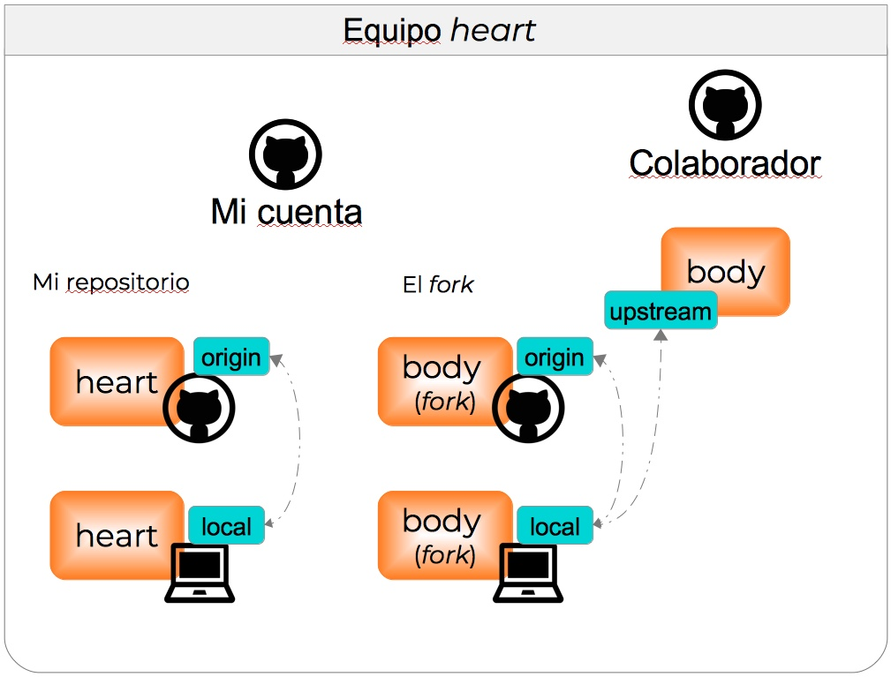
```
</div>
</div>


D) En la terminal entra al *fork*

E) Identifica el o los repositorios remotos a los que que está conectada esta copia local del *fork*. 

```{bash, eval=FALSE, engine="sh"}
git remote -v
```


F) Añade eñ repositorio de tu colaborador como ***upstream*** ( [Link al repositorio de tu colaborador](https://docs.google.com/spreadsheets/d/1Kx0bI-u5aE2xXp5TaiyRQmRTjgxG5qykqh4ie9qOtyU/edit?usp=sharing) ):

  - Si eres del **equipo** ***body***
```{bash, eval=FALSE, engine="sh"}
git remote add upstream https://github.com/colaborador/heart.git
```

  - Si eres del **equipo** ***heart***
```{bash, eval=FALSE, engine="sh"}
git remote add upstream https://github.com/colaborador/body.git
```

G) Observa cómo cambio la configuración de los repositorios remotos.

```{bash, eval=FALSE, engine="sh"}
git remote -v
```

H) Revisa los cambios que ha hecho tu colaborador

```{bash, eval=FALSE, engine="sh"}
git fetch upstream
git log -p HEAD..FETCH_HEAD
```

I) Ahora puedes añadir los cambios usando:

```{bash, eval=FALSE, engine="sh"}
git merge upstream/main
```

O bien,

```{bash, eval=FALSE, engine="sh"}
git pull upstream main
```

J) Nota que los cambios se añadieron a la copia local del *fork*, pero no al repositorio ***origin*** en GitHub. Para añadir los cambios en ***origin***.

```{bash, eval=FALSE, engine="sh"}
git push origin
```

Ahora tu copia del *fork*, está sincronizada con el repositorio *upstream* y el repositorio *origin*.


## Cambios desde un *fork* hacia el repositorio *upstream*

<div class="cyan color">

Tienes planeado trabajar en el *fork* para añadir una gráfica al proyecto de tu colaborador.

</div>

### Trabajando con ramas

---

Git y GitHub permiten generar **ramas**. Cada repositorio tiene una rama principal (***main***), que muestra la versión principal del proyecto. Los colaboradores pueden generar nuevas ramas, que serán versiones separadas de ***main*** y trabajar en ellas sin que ***main*** se vea afectada durante el proceso.

```{r, echo=FALSE, out.width='60%', fig.align='center'}
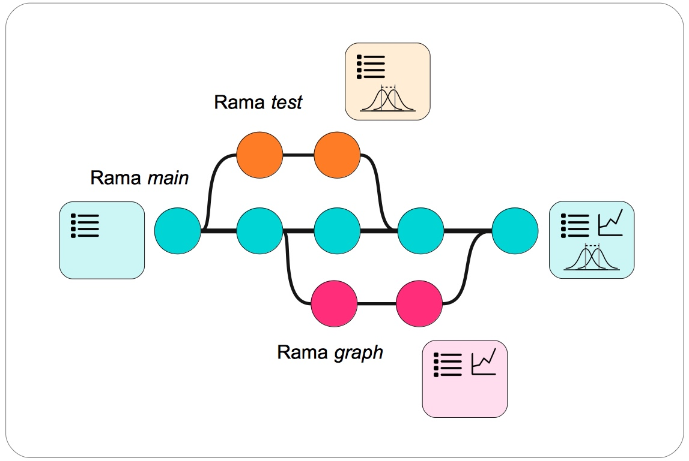
```

---

A) Ve a la terminal y **entra al** *fork*. Observa las ramas actuales del repositorio

```{bash eval=FALSE, engine="sh"}
git branch
```

B) Crea una **nueva rama** ***graph*** que te servirá para añadir una gráfica al análisis.

```{bash, eval=FALSE, engine="sh"}
git branch graph
```

C) Observa nuevamente las ramas.
```{bash eval=FALSE, engine="sh"}
git branch
```

D) Cambia a la rama *graph*.

```{bash, eval=FALSE, engine="sh"}
git checkout graph
```

E) Abre RStudio y establece al *fork* como directorio de trabajo.

F) Abre el *script* de R y haz una adición al análisis


  -Si eres del **equipo** ***body*** abre el *script* heart.R y añade
```{r eval=FALSE, paged.print=TRUE}
#Gráficas del peso del corazón por sexo

boxplot(Hwt ~ Sex, data = cats)
```

  -Si eres del **equipo** ***heart*** abre el *script* body.R y añade
```{r eval=FALSE, paged.print=TRUE}
#Gráficas del peso del cuerpo por sexo

boxplot(Bwt ~ Sex, data = cats)
```

<div class = "orange color">
**Nota sobre el análisis:**

Ejecuta el *script* body.R o heart.R. Las gráficas muestran una distribución del peso del cuerpo y del corazón distinta para gatos hembras y machos.
</div>
    
G) Guarda los cambios al *script* en RStudio

H) En la terminal añade los cambios en el *fork* mediante un *commit*.

I) Envía los cambios a al repositorio ***origin***, creando una nueva rama.

```{bash eval=FALSE, engine="sh"}
git push origin graph
```


### Abrir un *Pull Request*

Para comenzar este proceso ve al *fork* que creaste en GitHub ( [Link al fork](https://docs.google.com/spreadsheets/d/1Kx0bI-u5aE2xXp5TaiyRQmRTjgxG5qykqh4ie9qOtyU/edit?usp=sharing) )

<div class="scroll">

A) Ve al *fork* en GitHub. Observa que ahora existen dos ramas. Cambia a la rama *graph*

```{r, echo=FALSE, out.width='80%', fig.align='center'}
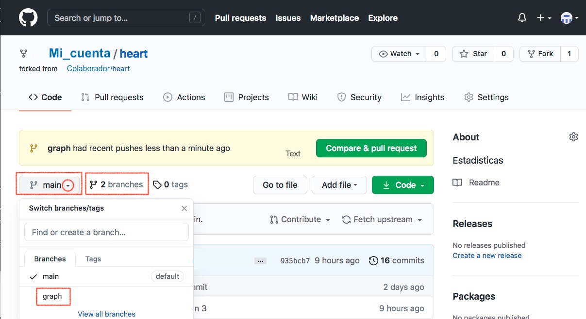
```

B) Selecciona la opción *Contribute* y después *Open pull request*

```{r, echo=FALSE, out.width='80%', fig.align='center'}
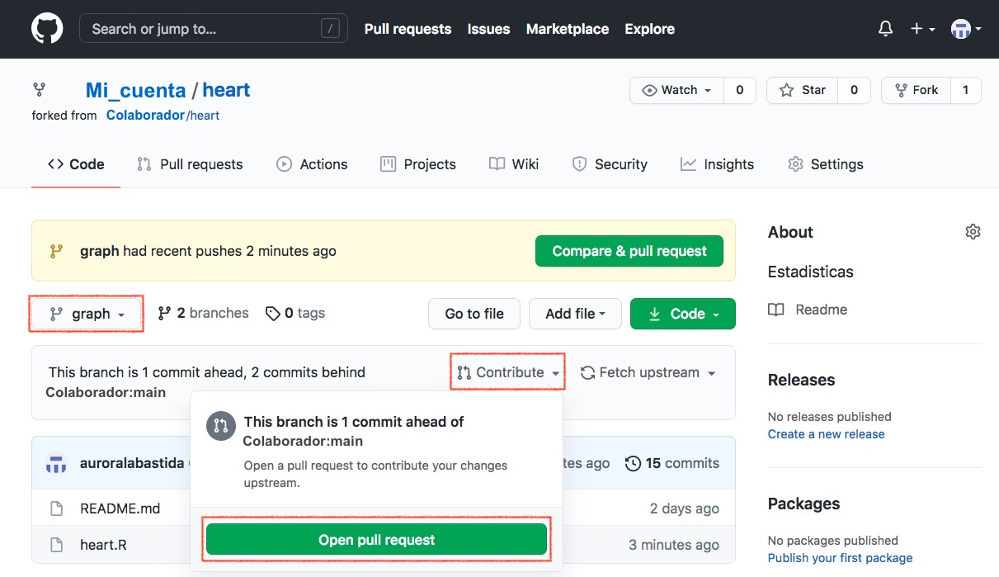
```

C) Nota que has pasado del *fork* al repositorio *upstream* (el de tu colaborador). Abre el *Pull Request* dejando una nota.

```{r, echo=FALSE, out.width='80%', fig.align='center'}
knitr::include_graphics('img/GitHub_Open_pull_request_2.jpeg')
```

```{r, echo=FALSE, out.width='80%', fig.align='center'}
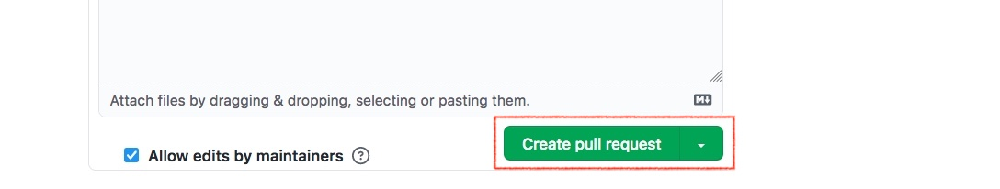
```

</div>

### Aceptar un *Pull Request*

<div class="cyan color">
Tu colaborador ha enviado una contribución desde su *fork* hacia tu repositorio de GitHub. Ve a tu repositorio para aceptar su *Pull Request*. 

( [Link al tu repositorio](https://docs.google.com/spreadsheets/d/1Kx0bI-u5aE2xXp5TaiyRQmRTjgxG5qykqh4ie9qOtyU/edit?usp=sharing) )

</div>

<div class="scroll">

A) Ve a tu repositorio en GitHub, abre la pestaña *Pull Requests* y después el *Pull Request* de tu colaborador

```{r, echo=FALSE, out.width='80%', fig.align='center'}
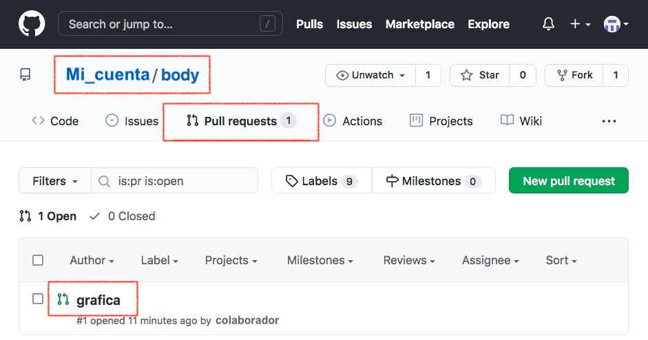
```

B) En la nueva página selecciona ***Merge pull requests***

```{r, echo=FALSE, out.width='80%', fig.align='center'}
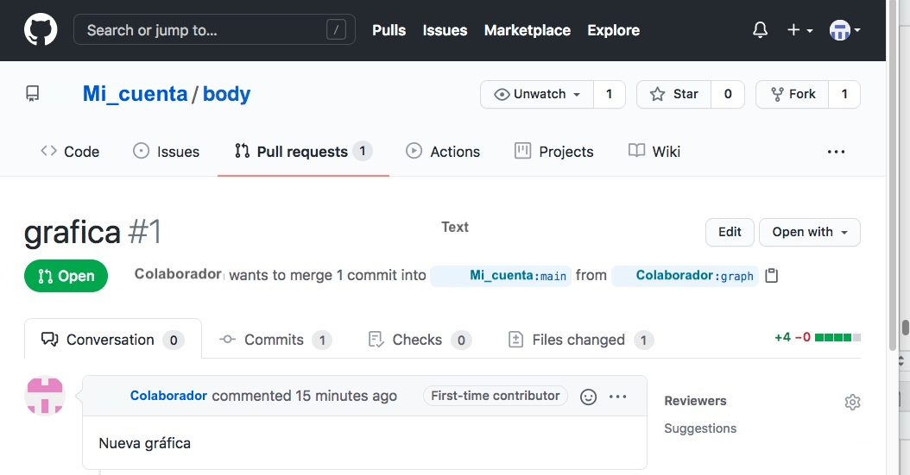
```

```{r, echo=FALSE, out.width='80%', fig.align='center'}
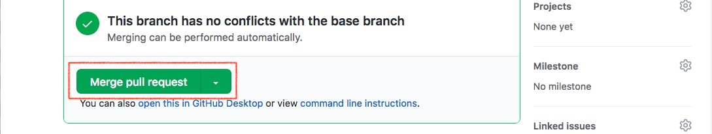
```

C) Ahora utiliza ***Confirm merge***

```{r, echo=FALSE, out.width='80%', fig.align='center'}
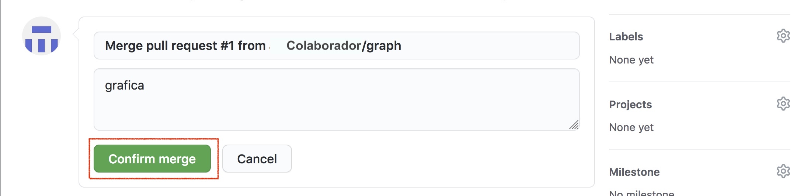
```

</div>

### Sincronización final del *fork*

<div class="cyan color">
Tu colaborador ha aceptado tu *Pull Request*. Tu cotribución ya está en la rama *main* del repositorio *upstream*. Ahora debes actualizar la rama *main* de tu *fork* con los mismos cambios.
</div>

A) En GitHub ve a la la rama *main* del fork y utiliza a **Fetch upstream** ( [Link al fork](https://docs.google.com/spreadsheets/d/1Kx0bI-u5aE2xXp5TaiyRQmRTjgxG5qykqh4ie9qOtyU/edit?usp=sharing) ).

B) Ve a la terminal de Linux/Mac y actualiza la copia local del *fork*. Primero ve a la rama main.

```{bash eval=FALSE, engine="sh"}
git checkout main
````

C) Y acualiza la rama main con el contenido del repositorio origin.
```{bash eval=FALSE, engine="sh"}
git pull origin main
```

D) Una vez que tus cambios están añadidos a la rama *main* en los repositorios local, *origin* y *upstream* puedes eliminar la rama *graph*

  - Para eliminarla de la copia local del *fork*

```{bash eval=FALSE, engine="sh"}
git branch -d graph
```

  - Para eliminarla en el repositorio *origin* (en GitHub)

```{bash eval=FALSE, engine="sh"}
git push origin --delete graph
```


