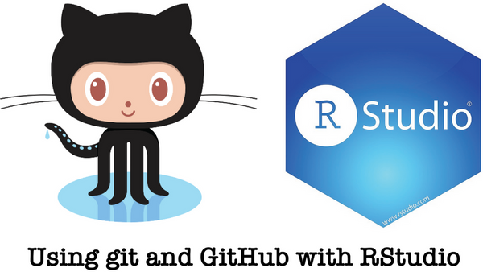
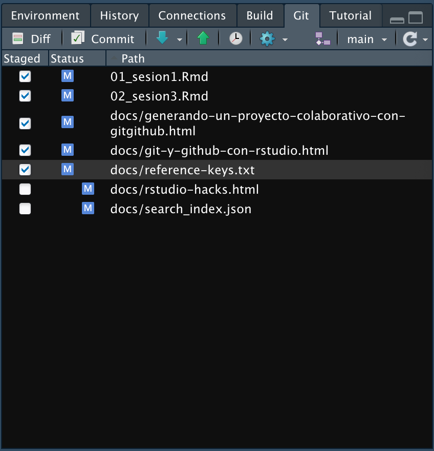
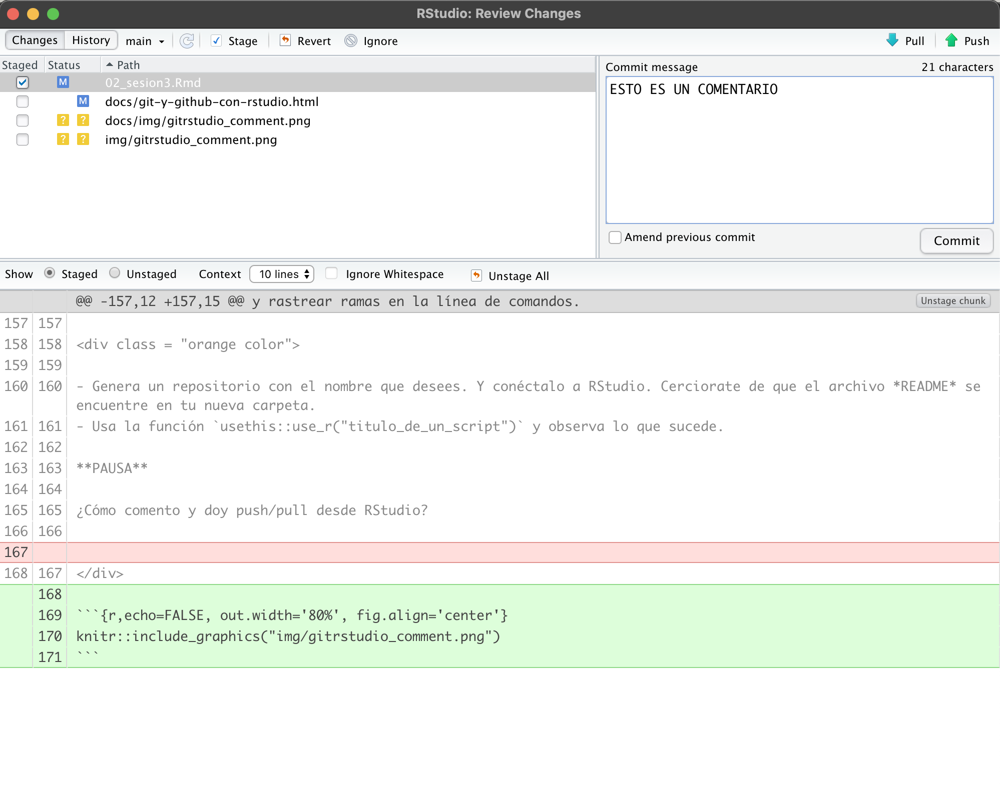

# Git y GitHub con RStudio

Erick Cuevas-Fernández

10 de agosto de 2021

<style>

div.color { 
border-radius: 5px; 
padding: 20px;
margin: 30px 0px 30px;}

div.red { background-color:#f67155; }

div.orange{ background-color:#f0BB51;}

div.pair { 	
display: flex;
flex-direction: row;
justify-content: center;
text-align:center;
padding:0px}

div.inside { width: 49%; padding: 0px}

div.scroll { 
max-height: 400px; 
overflow-y: auto; 
background: #111111;
border-radius:5px;
padding: 10px;
margin: 30px 0px 30px;
color: #999999;}

div.alert{color:#bd475d; background-color:transparent}
</style>


- Este documento se basa en "Happy Git with R" de Jenny Bryan, los STAT 545 TAs, Jim Hester


https://happygitwithr.com

## Manual de sobreviviencia con Git Y GitHub en RStudio (en caso de ser necesario)

- Por cualquier problema con la conexión entre RStudio y Git, siempre ten en cuenta la ubicación de dónde se instaló Git. 
    - Puedes usar en la terminal `which git` (Mac y Linux)
    - O bien usar en la terminal `where git` (Windows)
    
- Recuerda que la terminal (o línea de comandos ó consola ó shell ó bash) es un programa en tu computadora que funciona para correr otros programas. Desde RStudio puedes abrir la **terminal**, lo cual es muy conveniente si estás trabajando en un proyecto. Puedes abrir una terminal con:
    - *Tools > Terminal* (abre la terminal dentro del IDE de RStudio)
    - *Tools > Shell* (abre una terminal externa a RStudio)

- La recomendación actual de **GitHub** es usar *HTTPS* porque es la manera más fácil de configurar y tiene operabilidad en multiples redes y plataformas.  
    - Es menos probable que HTTPS sea bloqueado por un firewall.
    - Una conexión HTTPS permite que `credential.helper` almacene en caché su contraseña. (por tanto puedes configurar tu usuario y contraseña en tu equipo de uso)
    - Es más sencillo acceder a un repositorio desde cualquier lugar, ya que solo necesita los detalles de su cuenta (no se requieren claves SSH) para escribir en el repositorio.
    
- Usualmente cuando inicies un proyecto colaborativo con GitHub inicializa el ropositorio con un README. Copia el HTTPS URL para clonar el repositorio en la *terminal* `git clone https://github.com/TU-USUARIO/TU-REPOSITORIO.git`. 
    
## Credenciales HTTPS en **Cache**

Puedes crear un token de acceso personal, **PAT** (*PERSONAL ACCESS TOKEN*), esa será tu credencial para HTTPS. Es una alternativa al uso de contraseñas para la autenticación en GitHub cuando utilizas la API de GitHub o la línea de comandos.
Como precaución de seguridad, GitHub elimina automáticamente los tokens de acceso personales que no se han usado durante un año. 

<div class="alert">

**OJO** PARA FINES DEL CURSO POR AHORA NO GENERAREMOS UN TOKEN, este proceso realizalo cuando tengas planificado donde guardar tu contraseña y trabajes con una computado personal. 

</div> 

**¿Cómo crear un token?**

1. Ve a tu perfil de GitHub, dale click a la imagen de perfil (usualmente en la esquina superior derecha), y busca la opción de *settings* ó *configuración* según sea la configuración de idioma que tengas. 

2. Da click a continuación en *Developer settings* ó *Parámetros del desarrollador*. 

3. En la barra lateral izquierda da click en *Tokens de acceso personal*. 

4. Haz click en *Generar un nuevo token*.

5. Asígna un nombre descriptivo a tu token. 

6. Selecciona los alcances o permisos que deseas otorgarle a este token. Para usar tu token para acceder a repositorios desde la línea de comando, selecciona repo. 

7. Finalmente haz click en *generar token*.

8. Listo, copia y pega tu token en el lugar dónde siempre lo puedas volver a copiar, ya que por razones de seguridad, una vez salgas de la página no podrás volver a ver el token. 

- Nota: Preserva tus tokens de la misma manera que tus contraseñas y no se las reveles a nadie. Cuando trabajes con la API, usa tokens como variables del entorno en lugar de codificarlos de forma rígida en tus programas.

Una vez que tengas un token, puedes ingresarlo en lugar de tu contraseña cuando realices operaciones de Git a través de HTTPS.

El punto final es que una vez configurada una PAT, varios paquetes de R, incluidos *usethis* y *gh*, podrán trabajar con la API de GitHub en su nombre, de forma automática. Por lo tanto, una PAT configurada correctamente significa que todo esto funcionará a la perfección:

    - Operaciones HTTPS remotas a través de la línea de comando Git y, por lo tanto, a través de RStudio
    - Operaciones HTTPS remotas a través del paquete gert R y, por lo tanto, usethis
    - Operaciones de la API de GitHub a través del paquete gh R y, por lo tanto, usethis

**¿Cómo crear un token desde R?**

Puedes ir directamente a la página de GitHub a la parte para generar tu token de acceso personal mediante la siguiente función: 

```{r, eval=FALSE}
usethis::create_github_token()
```
Y con las opciones que se mencionaban anteriormente puedes configurar y crear tu **PAT**. 

Si lo que quieres especificar tu **PAT** en RStudio, las siguientes funciones te serán útiles:

```{r, eval=FALSE}

library(gitcreds)

gitcreds_set()

```

```{r, eval=FALSE}

library(credentials)

set_github_pat()

```

Para eliminar credenciales utiliza la función `credentials::git_credential_forget()`

### Actividad
Ejecuta los códigos **PERO** no generes para tu **PAT** por ahora. 


## Conectando RStudio con Git y Github.

```{r,echo=FALSE, out.width='80%', fig.align='center'}

```

<div class = "red color">

Para lo que sigue a continuación, deberías tener esto:

1. Tener una cuenta en GitHub
2. **R** y **RStudio** actualizados
3. Git instalado
4. Saber que desde la terminal puedes hacer **push** y **pull**

</div>


## GitHub primero, RStudio después...

1. Crea un repositorio en GitHub: `mi_repositorio` > *Public* > *YES* initialize this repository with a *README* > `click`en el gran botón verde "Create repository"
2. En RStudio crea un nuevo proyecto: *File* > *New Project* > *Version Control* > *Git*. Ahi pega el URL del repositorio `https://github.com/mi_usuario/mi_repositorio.git`. Da click en *Create Project*. 

Esto nos generará los siguientes elementos:

- Un directorio nuevo
- Un repositorio Git enlazado a al repositorio de GitHub
- Un proyecto en RStudio

Con este procedimiento ya no es necesario preocuparse por configurar controles remotos Git
y rastrear ramas en la línea de comandos.

### Actividad

<div class = "orange color">

- Genera un repositorio con el nombre que desees. Y conéctalo a RStudio. Cerciorate de que el archivo *README* se encuentre en tu nueva carpeta. 
- Usa la función `usethis::use_r("titulo_de_un_script")` y observa lo que sucede.

</div>

**PAUSA**

¿Cómo comento y doy push/pull desde RStudio?

### Comentar, pull y push 

```{r,echo=FALSE, out.width='80%', fig.align='center'}

```

Con la **flecha azul** podemos hacer pull (**RECUERDA HACERLO ANTES DE HACER UN PUSH**), y con la flecha verde un push. Para poder comentar y hacer push debemos marcar con una flechita mediante un `click` en las pequeñas cajas blancas de la columna *Staged*, damoc click en *commit* lo cual no abre la siguiente ventana. 

```{r,echo=FALSE, out.width='80%', fig.align='center'}

```

Volvemos a dar `click` en *commit*, y finalizamos con *push* (flecha verde). 

### Actividad

<div class = "orange color">

- Usa el código `dir.create("mis_imagenes")` en la consola de tu sesión de RStudio (la que está vinculada a tu repositorio). Ejecuta el siguiente código quitando los `#`:

```{r, eval=FALSE}
data(MASS::cats)
# pdf("mis_imagenes/cats_plot.pdf") 
ggplot(cats, aes(x = Sex)) + 
    geom_bar(fill = "orange", color = "black") + theme_classic() +
    xlab("Sexo") + ylab("Número de Gatos") + ggtitle("Gatos")
# dev.off()
```

- Comenta y da push a los cambios que realizaste en el repositorio. 

</div>

## RStudio primero y GitHub también 

Usa uno de los proyectos que hayas generado en las sesiones anteriores, PERO, que no esté enlazado a GitHub. Ahora veremos como conectar un proyecto de R existente con GitHub. 
Realiza los pasos que hicimos en **GitHub primero, RStudio después** pero asegurate de crear un repositorio con un nuevo nombre. 

**Y LISTO!!** usa un simple `ctrl` + `c`, ó `mv` ó `click derecho` + `copiar` ó el método que prefieras para mover o copiar archivos. Copia los archivos de tu antigüo proyecto al proyecto nuevo. 
Solo haz *commit* y *push* y listo, lo que tenía en tu antigüo proyecto ya está enlazado a GitHub. 

### Actividad

<div class = "orange color">

Por equipos de 3 personas:

Copia y pega los archivos que generaste en el Repositorio que se compartió en
el **"Drive"** (elijan uno de los tres repositorios) en un respositorio conectado a GitHub. Todos clonen un repositorio de GitHub en común. Enlacelo a GitHub y sigan el procedimiento de **RStudio primero y GitHub también**.  

Seleccionen con que datos quieren trabajar por equipo:

 - gapminder
 - mtcars
 - cats
 
 Creen una carpeta para guardar imagenes. Por persona generen un grafico representativo de su dataset, guardelo en la carpeta de imagenes. Compartan entre el equipo sus creaciones al hacer **commit/pull/push**.  


</div>
## Proyecto existente, GitHub al final


```{r,echo=FALSE, out.width='80%', fig.align='center'}
knitr::include_graphics("img/elmo_hell.png")
```

Supongamos que tenemos un proyecto de R existente en algún lugar de nuestra computadora. 

<div class = "red color">

**NOTA:**
Para generar proyecto de RStudio desde la consola puedes utilizar el siguiente código:
```{r, eval=FALSE}
usethis::create_project()
```

O en RStudio con *File > New Project > Existing Directory* 

Si su proyecto ya es un proyecto de RStudio, ejecútelo.

</div>

¿Ya es un repositorio de Git? La presencia del panel de Git debería alertarlo. Si es así, ha terminado.

Sino este es el primer camino a seguir:

- Con el páquete **usethis** usa la función `usethis::use_git`
- En RStudio ve a *Tools > Project Options > Git/SVN*. Dentro de *Version control system*, selecciona *Git*. Y da click a *"Yes"* cuando aparezca *"Confirm New Git Repository?"*.

Si usaste RStudio o *usethis*, el proyecto debería reiniciarse en RStudio. Hazlo tu mismo si hizo git init. RStudio ahora debería tener un panel Git.

### Breviario cultural con los PATs

Si usas el paquete usethis Y has configurado un token de acceso personal (PAT) de GitHub has esto en R:

```{r, eval=FALSE}
usethis::use_github()
```

Esto creará un nuevo repositorio en GitHub, lo agregará como un control remoto, configurará una rama de seguimiento y lo abrirá en su navegador. Lea la ayuda de `use_github()` para conocer sus argumentos y consejos sobre cómo configurar una PAT. Esto es extremadamente útil para una variedad de flujos de trabajo que llaman a la API de GitHub. Considere configurar esto si usa usethis, devtools o gh con regularidad.

----

Volviendo al tema de **Proyecto existente, GitHub al final**. 

Otra opción que se puede hacer para conectar un proyecto existen a GitHub es ir a hacer un repositorio a GitHub **PERO** ten en cuenta los siguientes cambios:

1. Elije un nombre de repositorio; probablemente debería coincidir con el nombre de su proyecto y directorio local.
2. **NO** inicialice este repositorio con un archivo *README*.

Todo lo demás es igual a los pasos que hacíamos en **GitHub primero, RStudio después...**

Ahora ve a tu proyecto de RStudio, has clic en los **"dos cuadros de color púrpura y un cuadrado blanco"** en el panel de Git. Has clic en **"Agregar control remoto"**. Pegue la URL aquí y elija un nombre remoto, casi con certeza el **origin**. Ahora **"ADD"**.

```{r,echo=FALSE, out.width='80%', fig.align='center'}
knitr::include_graphics("img/purple_cuadros.png")
```

Pasado esto deberiamos volver en el cuadro de diálogo **"New Branch"**. Ingresa **"master"** como el nombre de la rama y asegúrate de que la opción **"Sync branch with remote"** esté marcada. Haz clic en **"Create"**. En el siguiente cuadro de diálogo elije **"overwrite"**. 

```{r,echo=FALSE, out.width='80%', fig.align='center'}
knitr::include_graphics("img/add_remote_rstudio.png")
```

Ahora solo haz **commit/pull/push** y cérciorate que FUNCIONE!!

### Actividad

<div class = "orange color">

Por equipos hagan lo siguiente:

1. Usa un proyecto que no esté enlazado a GitHub.
2. Genera un repositorio que tenga el mismo nombre de tu proyecto siguiendo las instrucciones recientes. 
3. Enlaza tu repositorio con el proyecto existente.

**¡QUE LA FUERZA TE ACOMPAÑE!**

</div>

