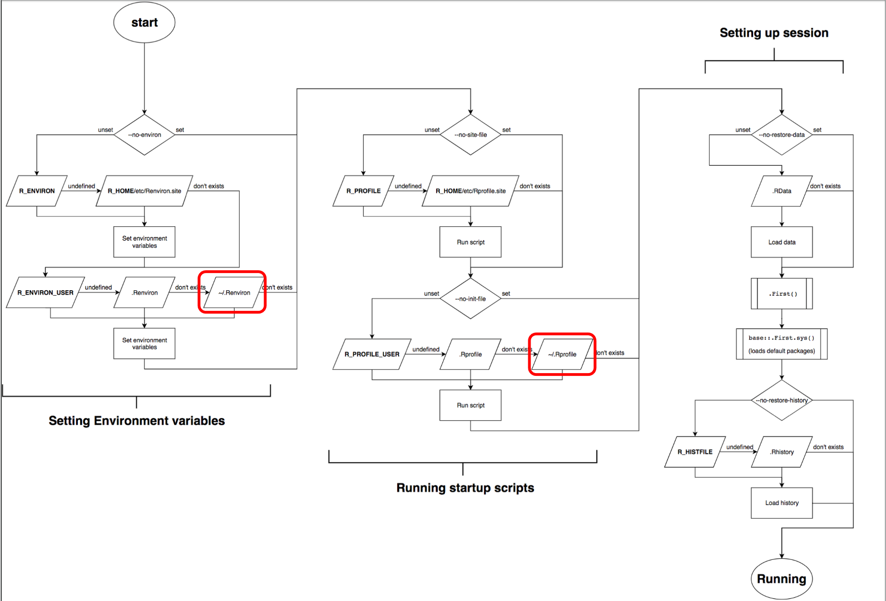
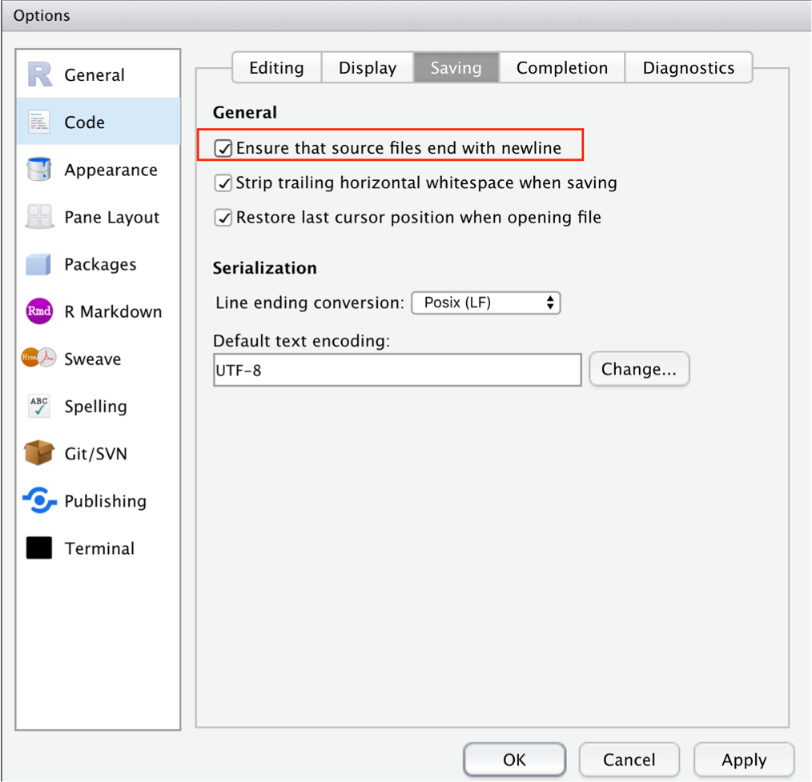
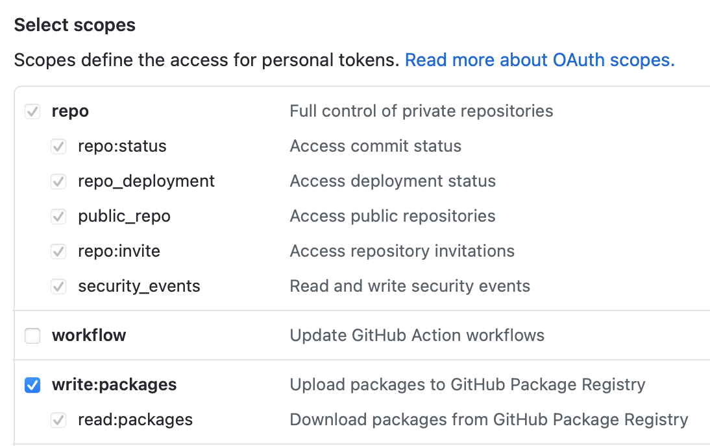
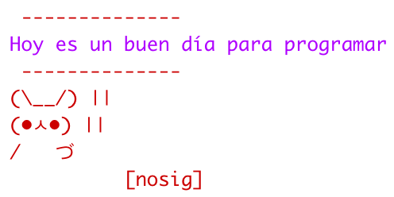
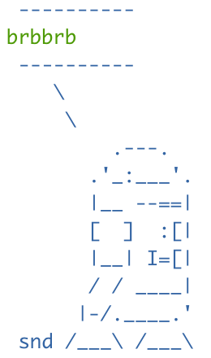

# Modificando los archivos de inicio de R

Joselyn Chávez

11 de agosto de 2021

<style>
div.grey { 
background-color: #bfbfbf;
}
</style>

<style>
div.center { 
text-align:center;
}
</style>


## Diapositivas

[
```{r, echo=FALSE}
knitr::include_url("https://comunidadbioinfo.github.io/cdsb2021_workflows/dia3_sesion1.html",
  height = "380px")
```
](https://comunidadbioinfo.github.io/cdsb2021_workflows/dia3_sesion1.html)


## ¿Qué son los archivos de inicio?

R ofrece una gran diversidad de opciones para personalizar el espacio de trabajo, sin embargo, esta flexibilidad conlleva un alto grado de complejidad. 

```{r,echo=FALSE,out.width='100%',fig.align='center',fig.cap="R Startup flowchart de Thomas Lin Pedersen"}

```

Al iniciar R, una serie de procesos complejos se ejecutan tras bambalinas. En general, podemos concentrarnos en dos archivos:

- El archivo **.Renviron** contiene las variables del ambiente de trabajo que deberán ser establecidas al iniciar cada sesión.  
- El archivo **.Rprofile** contiene código de R que será ejecutado al iniciar cada sesión.

Estos archivos forman parte de una gran familia de archivos de personalización conocidos como *dotfiles* o archivos ocultos. Este tipo de archivos suelen contener las instrucciones necesarias para dirigir el comportamiento de diversos programas, en particular aquellos que suelen ejecutarse desde un ambiente de linea de comandos. 

Muchas personas suelen conservar este tipo de archivos dentro de sus repositorios, por ejemplo en GitHub. Consultar los archivos ocultos de otros desarrolladores puede ser una referencia o fuente de inspiración para conocer todo lo que es posible hacer con estos archivos. 

Una forma rápida para encontrar este tipo de archivos dentro de los repositorios de GitHub es usando la herramienta de búsqueda y escribir .Rprofile.

Antes de comenzar a editar estos archivos, es importante que tengas en cuenta que deben terminar en  linea en blanco. Si lo prefieres, puedes marcar esta opción en la configuración de RStudio que asegurará que tus archivos fuente siempre cumplan esta condición. 

```{r,echo=FALSE,out.width='60%', fig.align='center'}

```

Puedes encontrar más información sobre los archivos de punto en https://dotfiles.github.io/

## Modificando el archivo .Renviron

El archivo .Renviron es útil para configurar cómo se comporta el ambiente de R, por ejemplo, podemos establecer el número de lineas que deseamos almacenar y mostrar en nuestra historia de comandos (history).

Para ver todas las variables de tu .Renviron ejecuta este comando:

```{r,eval=FALSE}
Sys.getenv()
```

NOTA: Cada vez que hagas un cambio en el archivo .Renviron debes guardar el archivo y reiniciar la sesión de RStudio para que los cambios se vean reflejados. Usa el menú principal y selecciona Session > Restart R o el atajo del teclado shift + command + F10 o shift + ctrl + F10.

Es importante recordar que las variables que estamos configurando en el archivo .Renviron **no** son código de R. Estas variables usan un formato similar a los usados en la linea de comandos de shell.

### Modificando el historial de la sesión

- Dale un vistazo a la ventana History en tu sesión de RStudio, ¿Cuántos comandos ves?. Si tu historial está en blanco, escribe algunos comandos sencillos en la consola para que puedas ver el comportamiento de tu History. Puedes ejecutar el comando Sys.getenv() y buscar la variable R_HISTSIZE para conocer el tamaño máximo de tu historial actual.
- Ahora abre el archivo .Renviron, la forma más sencilla de hacerlo es usando el siguiente comando:
```{r,eval=FALSE}
usethis::edit_r_environ()
```
- Vamos a modificar el tamaño de la historia de comandos a mostrar, escribe 'R_HISTSIZE=3' dentro del archivo .Renviron.
- Guarda los cambios y reinicia la sesión de RStudio.
- Comienza a escribir algunos comandos sencillos en la consola y observa cuántos comandos se muestran en la ventana History. ¿Notas la diferencia?

### Modificando el comportamiento de las funciones

Las modificaciones a las variables del archivo .Renviron también nos permiten controlar cómo se va a comportar nuestro entorno de R cuando evaluamos ciertas condiciones y nos permitirá ser más estrictos al evaluar las variables de entrada a nuestro código. Veamos un ejemplo:

<div class = "grey color">
<div class = "center">**Actividad 1**</div>

- Define un vector x <- c(5, -2).
- Escribe una función que te permita evaluar si los elementos dentro de este vector son positivos o negativos, tomando en cuenta si son menores o mayores a cero. (Pista: usa los condicionales if() y else() ). Recuerda que la estructura básica para escribir una función es:

```{r,eval=FALSE}
mifuncion <- function(x) {
    # aquí va el cuerpo de la función
}
```

- Evalúa los elementos del vector *x* usando tu función. Observa detenidamente el resultado.
- Ahora, escribe en tu archivo .Renviron la siguiente variable: _R_CHECK_LENGTH_1_CONDITION_=true guarda los cambios y no olvides reiniciar tu sesión.
- Vuelve a ejecutar la evaluación del vector *x* usando tu función. ¿Qué diferencia notas?
</div>

### Generando un .Renviron por proyecto

Cuando iniciamos una sesión de RStudio se pasa por varios niveles de revisión sobre la configuración de nuestra sesión. Este proceso ocurre muy rápido y la mayoría de los usuarios no necesita revisarlo a profundidad, pero cuando trabajamos en una organización puede sernos útil conocer que el proceso de inicio va del nivel más general (todos los usuarios) hasta el más particular (un sólo usuario o un proyecto en específico)

```{r,echo=FALSE,out.width='50%',fig.align='center'}

```

Hasta el momento, las modificaciones al .Renviron las hemos realizado en nuestro usuario general o *home* de nuestra instalación, pero también podemos generar configuraciones específicas para un proyecto de RStudio. 

- usethis::edit_r_environ() abre el .Renviron de tu usuario.
- usethis::edit_r_environ("project") abre el .Renviron de tu proyecto actual.

Vamos a revisar cómo generar un .Renviron para un proyecto:

- Limpia las configuraciones de tu archivo .Renviron que escribimos hasta ahora.
- Crea un nuevo proyecto. Observa la lista de archivos dentro de tu proyecto, hasta este punto solamente debe existir el archivo .Rproj.
- Dentro del proyecto ejecuta el comando usethis::edit_r_environ("project") que te abrirá un archivo .Renviron, nota que en la lista de archivos de tu proyecto se ha agregado este archivo de inicio.

<div class = "grey color">
<div class = "center">**Actividad 2**</div>

- Agrega la variable _R_CHECK_LENGTH_1_CONDITION_=true que usamos anteriormente y vuelve a realizar la prueba de evaluación de números negativos y positivos del vector *x*. 
- Compara el comportamiento dentro de tu proyecto contra el que tienes en una sesión de RStudio fuera de tu proyecto. Verás que en la sesión general el error no se genera (comportamiento laxo), mientras que dentro de tu proyecto este mensaje de error sí aparece (comportamiento estricto).  
</div>

### Guardando tokens para la conexión con APIs

En .Renviron también podemos almacenar información sensible, por ejemplo, las llaves de autenticación para conectar con aplicaciones como GitHub. Esto es particularmente útil para la instalación de paqueterías desde el código fuente que veremos más adelante con detalle.

- En el GitHub de la CDSB existe un paquete llamado 'saludo', pero se encuentra como un repositorio privado. Solamente los colaboradores de este repositorio tienen acceso a él (Si estás inscrito en este taller, te hemos agregado como colaborador). De forma normal, podrías instalar un paquete desde GitHub usando el comando:

```{r,eval=FALSE}
remotes::install_github("comunidadbioinfo/saludo")
```

- Intenta ejecutar este comando, seguramente obtendrás un mensaje que dirá que este repositorio no existe, ¿Por qué pasa esto? Esto se debe a que tu ambiente de R no está conectado con tu usuario de GitHub, debemos indicarle nuestras credenciales usando un Token de autenticación.
- Vamos a tu usuario de GitHub y entra en Settings > Developer settings > Personal access tokens.
- Da clic en Generate new token.
- En las opciones 'Select scopes' selecciona 'repo' y 'write:packages'.

```{r,echo=FALSE,out.width='60%',fig.align='center'}

```

- Da clic en 'Generate token' y copia el token a tu portapapeles.
- Ahora abre tu archivo .Renviron y escribe GITHUB_PAT=TuToken (reemplaza la palabra TuToken con la clave que copiaste).
- Guarda los cambios y reinicia la sesión de R.
- Vuelve a probar con la instalación del paquete, esta vez el código debe funcionar.

Si colocas información sensible dentro del archivo .Renviron y estás trabajando con un repositorio de GitHub, entonces no querrás dejar expuesto este archivo al público. Puedes agregar este archivo en la lista de archivos a ignorar por git, para esto deberás listarlo dentro del archivo .gitignore o puedes utilizar el paquete *credentials* (disponible en CRAN) que te ayudará a almacenar tu token de autenticación sin dejarlo expuesto en el archivo .Renviron usando credentials::set_github_pat().

## Modificando el archivo .Rprofile

El archivo .Rprofile contiene código de R que será ejecutado cada vez que se inicia una sesión de R. Este código se ejecuta después de leer las configuraciones de nuestro .Renviron pero antes de que podamos escribir código en nuestra sesión. 

Este archivo se encuentra normalmente en nuestro directorio raíz o *home* (~/.Rprofile), aunque si lo necesitas puedes asignarle una ubicación diferente asignando una ruta dentro de la variable R_PROFILE_USER en el archivo .Renviron.

La forma más sencilla de abrir nuestro archivo .Rprofile es ejecutando el siguiente comando:

```{r,eval=FALSE}
usethis::edit_r_profile()
```

Algunas configuraciones que se hacen usualmente dentro del .RProfile son:

- Establecer la ventana de descarga de CRAN.
- Escribir un mensaje de bienvenida a la sesión.
- Personalizar el prompt de R.
- Establecer algunas configuraciones estéticas como el ancho de la pantalla o la forma en que se despliegan las variables numéricas.
- Cargar paquetes que se usan con mucha frecuencia (de manera MUY cautelosa). 
- Generar sobrenombres o abreviaturas a funciones que usamos frecuentemente.

Para ver todas las opciones disponibles a modficar y sus valores actuales usa el comando
```{r,eval=FALSE}
options()
```

### Modificando la estética de la consola

Habrás notado que el prompt de la consola es un símbolo ">" . Si por alguna razón esta apariencia no es de tu agrado, puedes modificarla usando por ejemplo:

```{r,eval=FALSE}
options(prompt = ">>>")
```
Guarda los cambios y reinicia la sesión, después debes escribir algo en tu consola para ver reflejado el cambio.

Si ejecutas esta función directamente en tu consola en lugar de escribirlo en .Rprofile también verás el efecto, pero solamente se mantendrá mientras estés en la sesión actual, la configuración volverá a su estado por defecto al reiniciar o cerrar la sesión.

### Modificando el número de dígitos

Ejecuta el comando options() y busca la variable 'digits', verás que por defecto es igual a 7. Esto significa que al realizar una operación matemática obtendremos máximo 7 dígitos en la consola. Probablemente sea más cómodo limitarlo a 3 dígitos, vamos a modificarlo.

- En la consola realiza la operación 1/3 y observa el número de dígitos que se generan.
- Ahora abre tu archivo .Rprofile usando usethis::edit_r_profile().
- Agrega el siguiente código:
```{r,eval=FALSE}
options(digits=3)
```
- Guarda los cambios y reinicia la sesión.
- Vuelve a realizar la operación 1/3 y observa la diferencia.

### Cargando paquetes frecuentes

Si eres un amante del tidyverse, es probable que cada uno de tus scripts de R comiencen con library(tidyverse) o al menos con library(dplyr) o library(ggplot2).

Para un uso personal, puede ser útil configurar el llamado de algunos paquetes cada vez que inicias sesión. Veamos un ejemplo:

- Asegúrate de tener instalado el paquete dplyr, si aún no lo tienes instalado puedes hacerlo con 

```{r,eval=FALSE}
install.packages("dplyr")
```

- Abre el archivo .Rprofile 
- Agrega el código: library(dplyr) dentro del archivo.
- Guarda los cambios y reinicia la sesión.
- Notarás que en la consola aparece el mensaje "Attaching package: ‘dplyr’".

### Asignación de sobrenombres a las funciones

En ocasiones nos encontramos con funciones que tienen nombres bastante elaborados o que nos cuesta trabajo recordar. Para este fin, podemos asignarles un sobrenombre dentro del .Rprofile que podemos aplicar a cualquier Rscript dentro de la sesión.

Veamos un ejemplo:

- Abre tu archivo .Rprofile usando usethis::edit_r_profile()
- Reemplacemos la función sum con su nombre en español suma, agrega el siguiente código:
```{r,eval=FALSE}
suma <- sum
```
- Guarda los cambios y  reinicia la sesión.
- Ahora usa la función suma como lo harías al sumar cualquier serie de números con sum().
```{r,eval=FALSE}
suma(1,2)
```

Ten presente, que este sobrenombre únicamente va a funcionar para tu usuario o computadora, incluso puede ser usado en un proyecto específico.

### Creando mensajes de error personalizados

Si necesitas un poco de ánimos para seguir escribiendo tu código, puedes agregar algunos mensajes personalizados de error.

- Abre el archivo .Rprofile
- Agrega el siguiente código:
```{r,eval=FALSE}
options(error= function() cat(' \\\ Sigue intentando! \n \\\  /\\_/\\
   ( o.o )
    > ^ <\n\n'))
```
- Guarda los cambios y reinicia la sesión.
- Ahora generemos un error a propósito, usa la función suma() que creamos hace un momento y dale un valor inesperado (por ejemplo un caracter) y observa el resultado.
```{r,eval=FALSE}
suma('a')
```


### Mensajes de bienvenida

Para generar mensajes de bienvenida y/o despedida de tu sesión, usaremos el siguiente código como base dentro de tu .Rprofile:

```{r,eval=FALSE}
if (interactive()) {
    .First <- function() {
        # aquí van los mensajes o las funciones para la bienvenida
    }

    .Last <- function() {
        # aquí van los mensajes o las funciones para la despedida
    }
```

Agreguemos un mensaje de bienvenida sencillo:

- Abre tu archivo .Rprofile usando usethis::edit_r_profile()
- Agrega el siguiente código:
```{r,eval=FALSE}
if (interactive()) {
    .First <- function() {
        print("Hola!")
    }
}
```
- Guarda los cambios y reinicia la sesión. Ahora verás que aparece el mensaje Hola! en tu consola al inicio de tu sesión.

Recuerda que en este archivo usamos código de R, así que podemos llamar a las funciones de los paquetes que tenemos instalados. Por ejemplo, puedes usar la función saludo::saludo() del paquete privado que instalaste previamente para generar saludos aleatorios.

- Abre tu archivo .Rprofile usando 
- Agrega el siguiente código:
```{r,eval=FALSE}
if (interactive()) {
    .First <- function() {
       print(saludo::saludo())
    }
}
```
- Guarda los cambios y reinicia la sesión un par de veces. Ahora verás que aparece un mensaje aleatorio en tu consola cada vez que inicias la sesión.

Si eres amante de los animales, puedes usar el paquete cowsay para generar imágenes de diversos animales usando código ASCII. Puedes instalarlo desde CRAN usando

```{r,eval=FALSE}
install.packages("cowsay")
```

- Veamos la lista de animales disponibles usando

```{r}
names(cowsay::animals)
```

- Para obtener el código ASCII de un conejo o cualquier animal de la lista podemos usar
```{r,eval=FALSE}
cowsay::animals["rabbit"]
```
```{r,echo=FALSE,out.width='45%',fig.align='center'}

```

Si eres fan de Star Wars, puedes usar el paquete starwarssay desarrollado por Erick Cuevas para que tus personajes favoritos te den la bienvenida. Puedes instalarlo desde GitHub usando

```{r,eval=FALSE}
remotes::install_github("Erickcufe/starwarssay")
```

```{r,echo=FALSE,out.width='25%',fig.align='center'}

```

<div class = "grey color">
<div class = "center">**Actividad 3**</div>

- Genera un mensaje de bienvenida y otro de despedida para tu sesión.
- Consulta la ayuda de la función cowsay::say() para ver ejemplos sobre cómo imprimir los mensajes de bienvenida con este paquete.
- Consulta la ayuda de la función starwarssay::say() para ver ejemplos sobre cómo imprimir los mensajes de bienvenida con este paquete.
</div>

### Generando un .Rprofile para cada proyecto

Hasta el momento hemos modificado el .Rprofile general de tu usuario, por lo que el código se ejecutará al abrir cualquier sesión de R dentro de tu computadora, pero así como puedes tener un archivo .Renviron para cada proyecto, también puedes tener un .Rprofile específico para cada proyecto de RStudio. 

Para generar un .Rprofile dentro de un proyecto usa el comando

```{r,eval=FALSE}
usethis::edit_r_profile("project")
```

<div class = "grey color">
<div class = "center">**Actividad 4**</div>

- Abre alguno de tus proyectos anteriores o crea uno nuevo.
- Dentro de tu proyecto ejecuta el comando usethis::edit_r_profile("project")
- Realiza algunas configuraciones específicas para ese proyecto, por ejemplo puedes generar un saludo específico o cargar algún paquete que usarás en especial dentro de tus análsis, como ggplot2().
- Recuerda guardar los cambios y reiniciar la sesión para que los cambios se vean reflejados.
</div>

### Reproducibilidad

Toma en cuenta que las configuraciones que hagas en tu .Rprofile solamente funcionarán dentro de tu usuario y computadora. Normalmente, en este archivo se incluye código que no afecta el comportamiento de un análisis, por lo que debes tener especial cuidado si cargas paquetes de análisis de datos como dplyr o ggplot2. Mantén presente que si compartes tu código es probable que las funciones de estos paquetes no funcionen en otra computadora, a menos que los llames de forma explícita dentro de tu código.

Como alternativa, puedes generar un archivo .Rprofile específico del proyecto donde indiques todas las configuraciones requeridas para que el código funcione. Recuerda compartir este archivo dentro de tu repositorio de GitHub o al usar otro medio para compartir tu proyecto.
