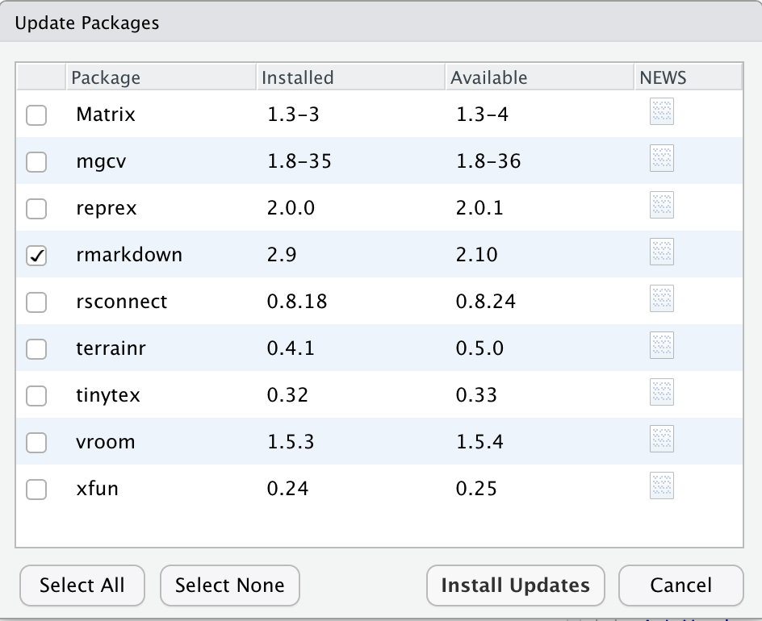
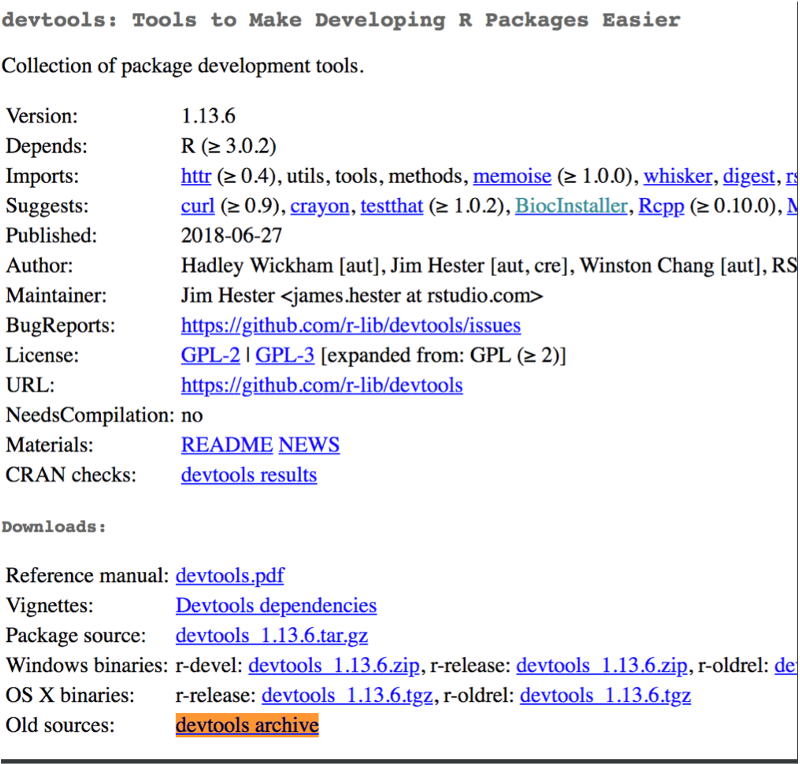

# Mantenimiento del espacio de trabajo en R

Joselyn Chávez

11 de agosto de 2021

<style>
div.grey { 
background-color: #bfbfbf;
}
</style>

<style>
div.center { 
text-align:center;
}
</style>

## Diapositivas

[
```{r, echo=FALSE}
knitr::include_url("https://comunidadbioinfo.github.io/cdsb2021_workflows/dia3_sesion3.html",
  height = "380px")
```
](https://comunidadbioinfo.github.io/cdsb2021_workflows/dia3_sesion3.html)


## Exploremos tu instalación de R

Los paquetes en R son la unidad natural para distribuir código. Actualmente, R base contiene alrededor de 14 paquetes de base y 15 paquetes recomendados en todas sus distribuciones.

El repositorio CRAN contiene ~ 18K paquetes que pueden ser instalados usando
```{r,eval=FALSE}
install.packages(“nombre_del_paquete”)
```

Por otro lado, Bioconductor contiene más de 2K paquetes de software, alrededor de 1000 paquetes de anotación, 400 de datos experimentales y  30 de flujos de trabajo. 

Para instalar paquetes desde Bioconductor necesitamos el paquete BiocManager:
```{r,eval=FALSE}
BiocManager::install("Biostrings")
```

Notarás que al instalar un paquete siempre aparece un mensaje mencionando la ruta donde el paquete será instalado.

Por defecto toda la instalación de R se genera dentro de un directorio que R asigna de forma automática, cuya ruta podemos encontrar con 
```{r,eval=FALSE}
.Library
```

Adicionalmente, existe una ruta donde R busca la disponibilidad de paqueterías instaladas. Esta ruta se actualiza con cada nueva versión de R. Podemos conocer o modificar esta ruta usando
```{r,eval=FALSE}
.libPaths()
```
Nota que esta ruta contiene la versión de R que tienes instalada, por ejemplo 4.1

## ¿Cómo sabemos qué paquetes tenemos instalados?

Si estás en RStudio puedes ir a la ventana Packages o usar el comando
```{r,eval=FALSE}
installed.packages()
```

Nota que este resultado muestra las propiedades del paquete, como la ruta donde se encuentra instalado, la versión del paquete, sus dependencias, la versión de R en que fue construida, entre otras.

<div class = "grey color">
<div class = "center">**Actividad 1**</div>

Aprovechemos las funciones de dplyr para analizar tus paquetes instalados.

- ¿Cuántos paquetes de tu instalación necesitan compilación?
- ¿Todos tus paquetes se construyeron en la misma versión de R?
- ¿Cuántos de los paquetes son de R base y cuántos son recomendados?

</div>

## ¿Cómo mantenemos actualizados nuestros paquetes?

Continuamente los paquetes tienen actualizaciones mejorando el código, agregando funciones o solucionando problemas de código. 

### Actualización de paquetes desde CRAN

Si te encuentras en RStudio, puedes ir a la ventana Packages > Update y seleccionar los paquetes que deseas actualizar.

```{r,echo=FALSE,out.width='70%', fig.align='center'}

```

Si te encuentras trabajando en la consola y deseas obtener una lista de los paquetes que tienen una actualización disponible puedes usar el comando
```{r,eval=FALSE}
old.packages()
```

Para actualizar un paquete en específico desde la consola puedes instalar nuevamente el paquete con
```{r,eval=FALSE}
install.packages("pkgname")
```

O usar el paquete devtools
```{r,eval=FALSE}
devtools::update_packages("pkgname")
```

Nota que las instrucciones anteriores se suelen usar para actualizar uno o algunos paquetes, pero si deseas actualizar todos los paquetes a la vez puedes usar el comando
```{r,eval=FALSE}
devtools::update_packages(TRUE) 
```

### Actualización de paquetes desde Bioconductor

Puedes conocer cuáles paquetes tienen una actualización disponible en Bioconductor con el comando

```{r,eval=FALSE}
BiocManager::valid()
```

Nota que este comando además te proporcionará el comando necesario para instalar los paquetes que requieren actualización.

Para instalar las actualizaciones basta con re-instalar el paquete con
```{r,eval=FALSE}
BiocManager::install("pkgname")
```

O puedes instalar todos los paquetes que requieran actualización con 
```{r,eval=FALSE}
BiocManager::install()
```

<div class = "grey color">
<div class = "center">**Actividad 2**</div>

- Revisa si tus paquetes se encuentran actualizados, usa algunas de las opciones que revisamos anteriormente.
- Si tienes paquetes que requieran actualizaciones, usa alguna de las opciones y actualiza un paquete. 
- Verifica que después de la actualización se haya eliminado de la lista de paquetes que requieren actualización. 
</div>

## Instalando una versión anterior de un paquete

En algunos casos necesitaremos instalar una versión anterior de algún paquete, por ejemplo para reproducir un análisis que se realizó hace tiempo o solucionar un problema de código.

Primero debes conocer el número de versiones anteriores del paquete. Para las paqueterías de CRAN, dirígete a la página del paquete, entra a la sección ‘Old sources’ y selecciona la versión que deseas instalar.

Después usa devtools para instalar esa versión en específico
```{r,eval=FALSE}
devtools::install_version("devtools", "1.13.6")
```

```{r,echo=FALSE,out.width='60%',fig.align='center'}

```

Revisa la versión que tienes instalada actualmente
```{r,eval=FALSE}
packageVersion("devtools")
```

Instala la versión anterior que desees
```{r,eval=FALSE}
devtools::install_version("devtools", "2.0.0")
```

Verifica la versión ahora
```{r,eval=FALSE}
packageVersion("devtools")
```

<div class = "grey color">
<div class = "center">**Actividad 3**</div>

Practiquemos la instalación de versiones anteriores de paquetes y su actualización.

- Revisa qué versión de ggplot2 tienes instalada.
- Busca la página de ggplot2 en CRAN y elige alguna versión anterior.
- Instala alguna de las versiones anteriores.
- Verifica que se haya instalado la versión que deseabas.
- Vuelve a actualizar el paquete.
- Verifica que se haya actualizado a la última versión disponible.
</div>


## Mantenimiento de paqueterías entre versiones de R

Cuando instalamos una actualización menor de R (por ejemplo si tenemos instalada la versión 3.5.0 y actualizamos a la versión 3.5.1) la instalación de nuestras paqueterías se conserva en el mismo directorio y no es necesario volver a instalarlas. 

Por el contrario, cuando realizamos actualizaciones grandes de R (por ejemplo de 3.5.3 a 3.6.0 o de 3.6.1 a 4.0.0) la ruta de instalación de nuestras paqueterías cambiará y por ello es posible que necesitemos instalarlas nuevamente.

```{r,echo=FALSE,out.width='40%',fig.align='center'}

```

Si sueles instalar un gran número de paqueterías pero no las usas frecuentemente, este cambio de ruta de instalación puede servir para reconsiderar cuáles paqueterías relamente necesitas volver a instalar. 

Sin embargo, si tienes un gran número de paqueterías que deseas conservar entre actualizaciones de R, existe una solución.

Una modificación interesante que podemos hacer dentro de .Renviron es seleccionar la ubicación donde serán instaladas las paqueterías de R usando la variable R_LIBS_USER.

Antes de modificar esta variable, veamos cómo se encuentra tu configuración actual. Ejecuta el siguiente comando para ver la ruta que por defecto R selecciona para instalar las paqueterías:

```{r}
Sys.getenv("R_LIBS_USER")
```

Si te encuentras trabajando en un sistema operativo OS/Mac, tu ruta se verá similar a R_LIBS_USER=~/Library/R/%v/library. Si te encuentras trabajando en Windows es muy probable que tu ruta se vea así: R_LIBS_USER=~/R/win-library/x.y 

Nota que la ruta menciona la versión de R que tienes instalada, en mi caso es la versión 4.1. Mantener esto en mente es importante porque cuando hagamos una actualización en el futuro, por ejemplo a R 4.2, esta ruta va cambiar.

Suponiendo que estás por instalar la futura versión de R, vamos a crear un directorio para instalar las paqueterías que corresponderán a esa versión.

- Crea un directorio con el número de versión que instalarás, usando el comando:
```{r,eval=FALSE}
fs::dir_create("~/Library/R/4.2/library") 
```
- Abre tu archivo .Renviron.
- Agrega la variable R_LIBS_USER y la ruta al directorio que acabas de crear. Usa R_LIBS_USER=~/Library/R/4.2/library para Mac o R_LIBS_USER=~/R/win-library/4.2 para Windows.
- Guarda los cambios y reinicia la sesión.

Ahora podemos instalar paquetes en este directorio.

- Instala el paquete dplyr usando el comando 
```{r,eval=FALSE}
install.packages("dplyr")
```
- Nota que en el mensaje de instalación se menciona la ruta donde está realizando la instalación.
- Verifica que dplyr se instaló en el nuevo directorio, usa el comando
```{r,eval=FALSE}
installed.packages("mi-nuevo-directorio") %>% 
                   as_tibble() %>% 
                   View()
```

Ahora puedes transferir todos los paquete que tienes instalados en tu versión actual y preparar el directorio que usará tu próxima versión de R.

Si deseas mantener todos los paquetes que tienes instalados actualmente, es recomendable guardar la lista de paquetes en una variable antes de cambiar de directorio de instalación y usarla dentro de los argumentos de tu comando de instalación.

- Reestablece el directorio de instalación que modificaste en el .Renviron.
- Genera la lista de paquetes instalados y guárdala en una variable
```{r,echo=FALSE,message=FALSE,warning=FALSE}
library(dplyr)
```

```{r}
pkgs <- installed.packages() %>% 
    as_tibble()
```
- Dale un vistazo al contenido de esta variable.
- Modifica el directorio de instalación en .Renviron.
- Instala los paquetes enlistados en pkgs.
```{r,eval=FALSE}
install.packages(pkgs$Package) 
```

Como alternativa, puedes usar el argumento lib de la función install.packages para indicar el directorio donde se instalarán estas paqueterías. De esta forma no es necesario modificar el .Renviron.

```{r,eval=FALSE}
install.packages(pkgs$Package, lib = "~/Library/R/4.2/library") 
```

Toma en cuenta que si tienes un gran número de paquetes enlistados en pkgs, este comando tardará un tiempo en completarse. Si solamente deseas seleccionar algunos paquetes, puedes usar filtros o selección de lineas ya sea con corchetes df[ ] o con las funciones de dplyr.

```{r}
pkgs$Package[445]
```
```{r,eval=FALSE}
install.packages(pkgs$Package[445], lib = "~/Library/R/4.2/library") 
```

- Finalmente, revisa si los paquetes que instalaste se encuentran en la nueva ubicación.
```{r,eval=FALSE}
installed.packages("~/Library/R/4.2/library") %>% 
                   as_tibble() %>% 
                   View()
```

<div class = "grey color">
<div class = "center">**Actividad 4**</div>

- Si aún no lo has hecho, genera un directorio para instalar paqueterías en una versión superior a la que tienes instalada.
- Enlista las paqueterías que tienes instaladas actualmente y guárdalas en una variable en formato tibble().
- Dale un vistazo a tu lista  de paqueterías y selecciona alguna o algunas de ellas.
- Instala estas paqueterías en el directorio correspondiente a la versión superior de R.
- Asegúrate que se encuentran listadas en el nuevo directorio.
</div>

Si deseas consultar más detalles sobre mantenimiento de nuestro ambiente de R puedes ir al siguiente link en inglés: https://rstats.wtf/maintaining-r.html

