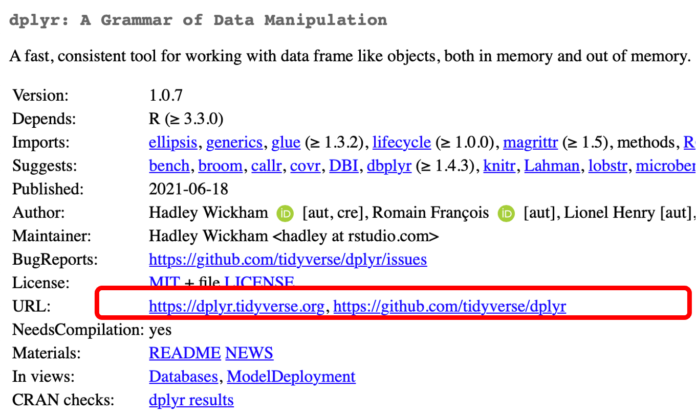
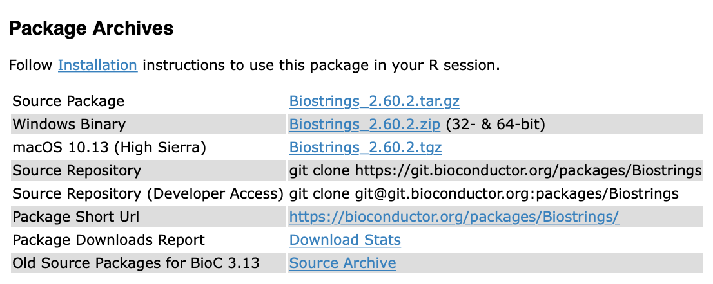

# Instalación de paquetes desde código fuente

Joselyn Chávez

11 de agosto de 2021

<style>
div.grey { 
background-color: #bfbfbf;
}
</style>

<style>
div.center { 
text-align:center;
}
</style>

## Diapositivas

[
```{r, echo=FALSE}
knitr::include_url("https://comunidadbioinfo.github.io/cdsb2021_workflows/dia3_sesion4.html",
  height = "380px")
```
](https://comunidadbioinfo.github.io/cdsb2021_workflows/dia3_sesion4.html)


## ¿A qué nos referimos con paqueterías de código fuente?

De forma usual, los paquetes que instalamos desde algún repositorio como CRAN o Bioconductor son paquetes binarios que ya se encuentran compilados previamente.

En algunas ocasiones necesitaremos instalar paquetes que no se encuentran compilados, por ejemplo: 

- Paquetes en desarrollo de CRAN o Bioconductor.
- Versiones anteriores de paquetes de CRAN o Bioconductor.
- Paquetes que no se encuentran depositados en CRAN o Bioconductor, sino en repositorios personales como GitHub.
- Paquetes que estás desarrollando de forma local.

Existen algunas funciones que nos permiten instalar paquetes desde código fuente. Anteriormente, se solían utilizar las funciones install_* del paquete devtools; sin embargo, recientemente se creó el paquete **remotes** que contiene las mismas funciones pero está específicamente diseñado para ayudarnos a trabajar con paquetes desde código fuente.

## ¿En dónde podemos encontrar el código fuente de un paquete?

Si el paquete se encuentra disponible en CRAN, puedes encontrar el link al código fuente en la sección URL.

```{r,echo=FALSE,out.width='50%', fig.align='center'}

```

Si el paquete se encuentra disponible en Bioconductor, puedes encontrar el link al código fuente en la sección Package Archives

```{r,echo=FALSE,out.width='50%', fig.align='center'}

```

Si el paquete se encuentra en GitHub o GitLab, necesitarás conocer el nombre de usuario del autor y el nombre del paquete que normalmente será también el nombre del repositorio a instalar.

## Instalando la última versión en desarrollo

- Si el paquete se encuentra depositado en CRAN podemos usar la función 

```{r,eval=FALSE}
remotes::install_dev("pkgname")
```

Por ejemplo, para instalar la versión en desarrollo de dplyr usaremos el comando
```{r,eval=FALSE}
remotes::install_dev("dplyr") 
```

- Si el paquete se encuentra en Bioconductor usaremos la siguiente función:

```{r,eval=FALSE}
remotes::install_bioc("pkgname")
```

Por ejemplo, para instalar la versión en desarrollo de regutools, el paquete desarrollado por miembros de la CDSB, usaremos el comando
```{r,eval=FALSE}
remotes::install_bioc("regutools")
```

<div class = "grey color">
<div class = "center">**Actividad 1**</div>

- Busca tu paquete favorito de CRAN o Bioconductor e instala su versión en desarrollo.
- ¿Recuerdas la función installed.packages()? Enlista tus paquetes instalados y explora la columna 'Version' del paquete que acabas de instalar. ¿Notas alguna diferencia?
</div>

## Instalando paquetes desde GitHub

Independientemente de si el paquete se encuentra en CRAN, Bioconductor, o ninguno de ellos, podemos instalar un paquete depositado en una cuenta de GitHub.

Para poder instalar un paquete desde GitHub necesitaremos conocer el usuario del creador y el nombre del repositorio donde se encuentra depositado el paquete. Con esta información usaremos la siguiente función:
```{r,eval=FALSE}
remotes::install_github("usuario/repositorio")
```

Por ejemplo, para instalar el paquete starwarssay desarrollado por Erick Cuevas (Erickcufe) utilizaremos el siguiente comando:
```{r,eval=FALSE}
remotes::install_github("Erickcufe/starwarssay")
```

<div class = "grey color">
<div class = "center">**Actividad 2**</div>

- El paquete **datos** contiene grupos de datos en español para usar dentro de R. Utiliza tu buscador (Google, por ejemplo) para encontrar la ubicación en GitHub de este paquete e instálalo.
- Verifica que se encuentre en tu lista de paquetes instalados y explora la información que te da la función installed.packages() sobre este paquete.
</div>


## Instalando versiones anteriores

- Si el paquete se encuentra depositado en CRAN usaremos la función
```{r,eval=FALSE}
remotes::install_version("pkgname",version = "version")
```

Por ejemplo, para instalar la versión 1.0.0 de dplyr usaremos el comando
```{r,eval=FALSE}
remotes::install_version("dplyr",version = "1.0.0")
```

- Si el paquete se encuentra en Bioconductoor usaremos el paquete BiocManager
```{r,eval=FALSE}
BiocManager::install(pkgs = "pkgname", version = "version")
```

Por ejemplo, para instalar la versión 1.1.1 de regutools usaremos el comando
```{r,eval=FALSE}
BiocManager::install(pkgs = "regutools", version = "1.1.1")
```

## Instalando un paquete local

Ya sea que hagas un fork y clone de un paquete o si tienes un paquete propio en desarrollo, esta función te ayudará a instalar el paquete de manera local.

```{r,eval=FALSE}
remotes::install_local()
```

Por ejemplo, vamos a generar un directorio temporal para instalar un paquete de prueba
```{r,eval=FALSE}
dir <- tempfile()
dir.create(dir)
```

Usaremos esta función para descargar el código fuente del paquete **testthat** en forma de directorio comprimido.
```{r,eval=FALSE}
pkg <- download.packages("testthat", dir, type = "source")
```

Al guardar los datos de la descarga en una variable, almacena la ubicación temporal donde se encuentra el archivo comprimido. Usaremos esta ruta para instalar el paquete desde su ubicación local.
```{r,eval=FALSE}
remotes::install_local(pkg[, 2])
```


<div class = "grey color">
<div class = "center">**Actividad 3**</div>

Instalemos un paquete de forma local.

- Crea un directorio temporal para la descarga de este ejercicio o utiliza un directorio que puedas localizar fácilmente.
- Descarga el directorio comprimido del paquete **palmerpenguins**. Puedes usar la función que vimos anteriormente o buscar su link de descarga desde CRAN o GitHub.
- Instala el paquete desde tu ubicación local. Recuerda escribir la ruta donde descargaste el directorio comprimido.
- Verifica que el paquete se encuentre en tu lista de paquetes instalados y explora sus propiedades dentro de la tabla de paquetes.
</div>

Una ventaja de descargar el directorio completo de un paquete de forma local es que puedes realizar cambios al paquete, probar que funciona de manera local y después contribuir con código para el creador (haciendo un pull-request).

¿Recuerdas el paquete **saludo** que instalamos anteriormente desde el GitHub de la CDSB? 

- Clona el repositorio en tu computadora usando el comando de git en tu terminal. Toma nota de la ruta donde lo estás descargando.
```
git clone https://github.com/ComunidadBioInfo/saludo.git
```

- Instala el paquete desde su ubicación local
```{r,eval=FALSE}
remotes::install_local("rutalocal")
```

Por ejemplo, si lo clonaste en Descargas el comando se verá similar a
```{r,eval=FALSE}
remotes::install_local("~/Downloads/saludo/")
```

<div class = "grey color">
<div class = "center">**Actividad 4**</div>

Agreguemos un mensaje de despedida aleatorio.

- Abre el proyecto del paquete **saludo**.
- Localiza la carpeta R.
- Dentro de la carpeta R, crea un nuevo script y escribe una función llamada **despedida()** que genere mensajes de despedida aleatorios. Puedes tomar como referencia el script que ya existe para la función saludo().
- Agrega la documentación necesaria.
- Ejecuta la función devtools::document() y después la función devtools::build() para compilar e instalar el paquete.
- Comprueba que puedes llamar a la función saludo::despedida() y que funciona correctamente.

</div>


