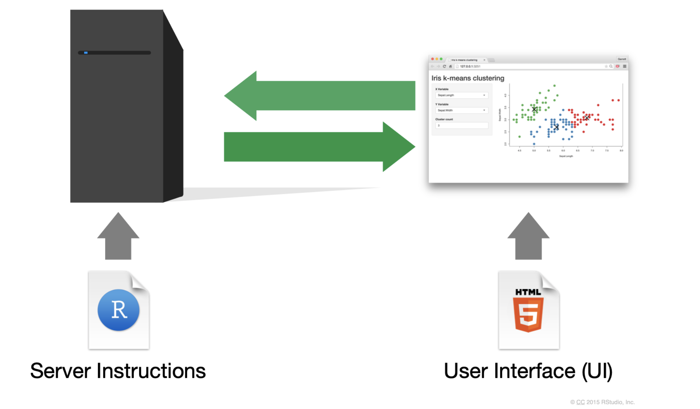
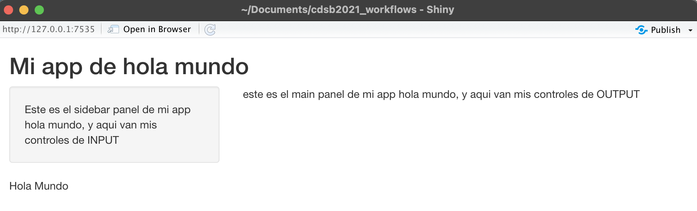
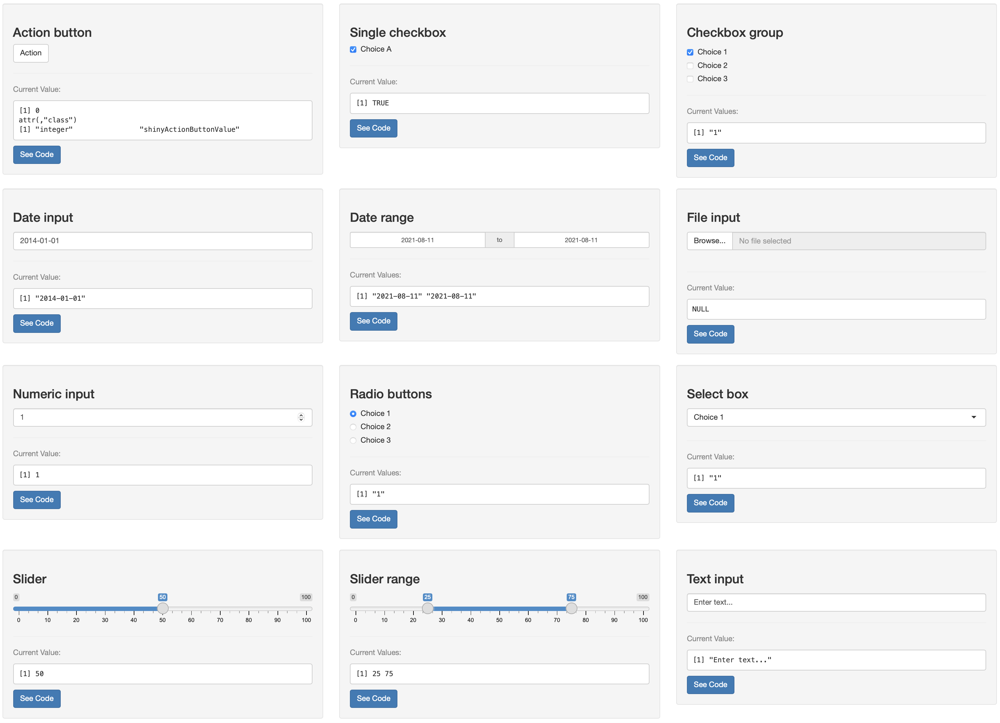
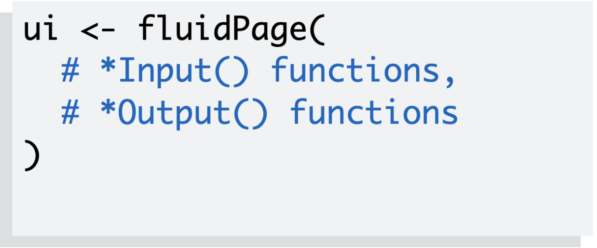
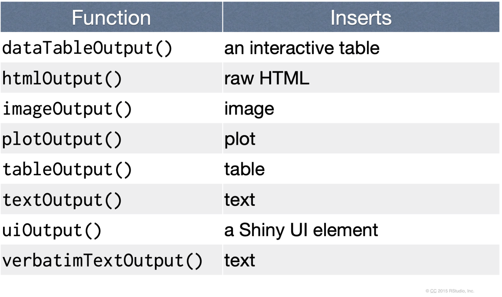
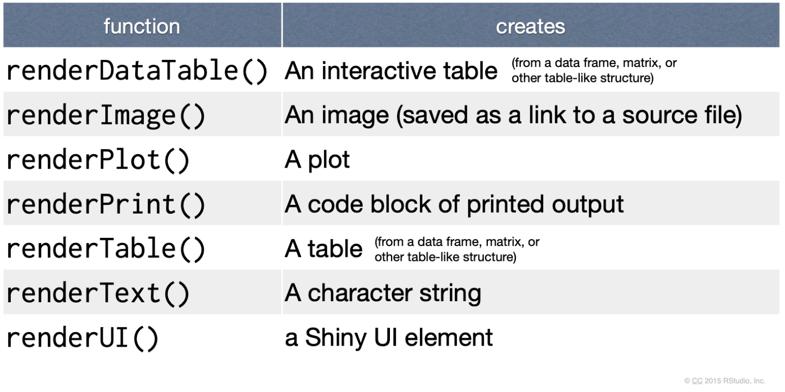
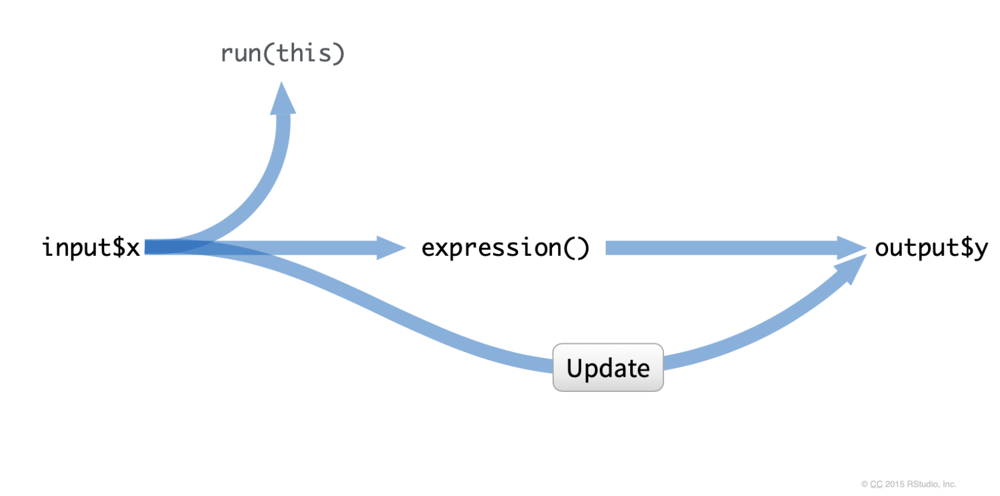

# Introducción a Shiny

Erick Cuevas-Fernández

12 de agosto de 2021

<style>

div.color { 
border-radius: 5px; 
padding: 20px;
margin: 30px 0px 30px;}

div.red { background-color:#f67155; }

div.orange{ background-color:#f0BB51;}

div.pair { 	
display: flex;
flex-direction: row;
justify-content: center;
text-align:center;
padding:0px}

div.inside { width: 49%; padding: 0px}

div.scroll { 
max-height: 400px; 
overflow-y: auto; 
background: #111111;
border-radius:5px;
padding: 10px;
margin: 30px 0px 30px;
color: #999999;}

div.alert{color:#bd475d; background-color:transparent}
</style>


Este material esta basado en:

- https://shiny.rstudio.com/tutorial/written-tutorial/lesson1/
- https://bookdown.org/weicheng/shinyTutorial/
- https://mastering-shiny.org/index.html


```{r,echo=FALSE, out.width='80%', fig.align='center'}
knitr::include_graphics("img/shiny_1.png")
```


## ¿Qué es y para qué me sirve Shiny?

Este paquete fue creado en 2012 por RStudio para desarrollar aplicaciones Web con el uso de R. 
Shiny es un paquete de R que nos permite generar módulos de mando web interactivos, crear interfaces para algoritmos o bien manipular en tiempo real tablas de datos y gráficos a través de controles de HTML. 

Para instalarlo puedes usar los siguientes códigos:

```{r, eval=FALSE}
install.packages("shiny")

if (!require("devtools"))
  install.packages("devtools")
devtools::install_github("shiny", "rstudio")

```

Mediante esta paquetería podemos personalizar nuestra creación de forma sencilla con sintaxis HTML, CSS o Javascript. Pero aún así solo se requieren conocimientos de R para emplear Shiny. 


Toda Shiny app es mantenida por una computadora que se encuentra corriendo R. 

<div class="alert">

**ANTES DE EMPEZAR** RECUERDA:

- Tener descargada la paquetería de **Shiny**
- Tener R y RStudio actualizado
- PACIENCIA Y MUCHO ENTUSIASMO

</div> 


## Los alcances de Shiny!!!


```{r,echo=FALSE, out.width='80%', fig.align='center'}

```

Desde el 2019 se celebra el **Shiny Contest**. En el primer certamén se sometieron a competencia 136 apps desarrolladas con Shiny!!!

Entre las apps que más se han destacado desde entonces están:

- [iSEE](https://kevinrue.shinyapps.io/isee-shiny-contest/?_ga=2.198531179.535201177.1628544099-1041498230.1628266132)
- [R Package Explorer](https://nz-stefan.shinyapps.io/cran-explorer/?_ga=2.265313995.535201177.1628544099-1041498230.1628266132)
- [RadaR](https://ceefluz.shinyapps.io/radar/)
- [EDsimulation](https://gallery.shinyapps.io/EDsimulation/)
- [Math Eagle Game](https://sharukkhanstat777.shinyapps.io/MathEagleGame/?_ga=2.122601167.535201177.1628544099-1041498230.1628266132)
- [HEALTHDOWN](https://hoga.shinyapps.io/healthdown/)

Y también puedes ver toda la galería de [Shiny Apps](https://shiny.rstudio.com/gallery/).

<div class = "red color">
**OJO**

LO MEJOR ES QUE TODAS LAS SHINY APPS COMPARTEN SU CÓDIGO EN GITHUB

RECUERDA VER LOS EJEMPLOS DE CÓDIGO. TENER PACIENCIA. PRACTICAR Y PRACTICAR...APRENDER... VOLVER A EQUIVOCARSE... EUREKA!

DESCARGA LA [**CHEAT SHEET**](https://www.rstudio.com/resources/cheatsheets/) DE SHINY 

</div>

## Primeros pasos: La estructura canónica de Shiny 

Toda aplicación web de Shiny tendrá la misma estructura, dos bloques de códigos de R:

- *ui*: genera una interfaz de usuario
- *server*: contiene las instrucciones que la computadora necesita para crear la app. 

La estructura de código de una app Shiny se vería del siguiente modo:

```{r, eval=FALSE}
library(shiny)

ui <- fluidPage(
xxxxInput(),
xxxxOutput()
)

server <- function(input, output)
{
 Codigo de R
}

shinyApp(ui = ui, server = server)
```

En RStudio puedes generar una nueva app con este molde de código mediante los siguientes pasos:

1. Crea un nuevo directorio y un archivo **app.R** que contenga una aplicación básica en un solo paso haciendo clic en *Archivo* | *Nuevo proyecto*, luego selecciona *Nuevo directorio* y *Shiny Web Application*.
2. Si ya has creado el archivo **app.R**, puedes agregar rápidamente el texto estándar de la aplicación escribiendo "shinyapp" y presionando `Shift + Tab`.
3. También puedes hacer dos scripts por separado, **ui.R** y **server.R** y ejecutar ambos en la app.R con `shinyApp(ui = ui.R, server = server.R)`.

Para que la app esté completa necesitas solo 4 cosas en tu **app.R**:

1. Cargar la paquetería de Shiny con `library(shiny)`
2. Definir la interfaz de usuario, la web HTML con la que interactúan quienes ocuparán la app. Es decir, definir la `ui`.  
3. Especificar el comportamiento de nuestra aplicación definiendo una función de `server`.
4. Ejecutar `shinyApp(ui, server)` para construir e iniciar una Shiny app.

### Actividad

<div class = "orange color">

**Genera un archivo app.R listo para hacer una Shiny app.** Puedes generar solo un app.R y posteriormente escribir en la consola "shinyapp" y presionar `Shift + Tab`

</div>


## La Interfaz de Usuario (**UI**)

Shiny por default usa [*bootstrap*](https://getbootstrap.com) (lo cual no tiene nada que ver con el método estadístico bootstrap). Esto es un marco de trabajo de HTML, CSS y Javascript más popular para desarrollar sitios web receptivos. 

**OJO**: si sabes usar HTML puedes usar todos los tags en Shiny. Puedes consultar estos tags con la siguiente función:

```{r, eval=FALSE}
shiny::tags
names(shiny::tags)
```

Shiny fomenta la separación del código que genera su interfaz de usuario (el front-end) del código que impulsa el comportamiento de su aplicación (el back-end).


```{r,echo=FALSE, out.width='80%', fig.align='center'}

```


Existe una comunidad rica y vibrante de paquetes de extensión, como
**shinyWidgets**, **colorpicker** y **sorttable**. Puede encontrar una lista
completa y mantenida activamente de otros paquetes en
https://github.com/nanxstats/awesome-shiny-extensions, mantenida por *Nan
Xiao*.

Para iniciar a entender como funciona la Interfaz de Usuario, en un archivo
`app.R` realiza lo siguiente:

       
```{r, eval=FALSE}

library(shiny)
ui <- fluidPage(
  "¡Hola mundo!"
)
server <- function(input, output, session) {
}
shinyApp(ui, server)

```

Corre la app con el botón `Run App` o simplemente ejecuta la línea de `shinyApp(ui, server)`. 

Dentro de la Interfaz de Usuario podemos tener:

- **Funciones de Layout**
- **Controles de input**
- **Controles de output**

### Los Layouts más comunes

Veamos un poco las funciones de Layout. A la misma app que tenemos arriba ahora vamos a agregarle lo siguiente:

```{r, eval=FALSE}
library(shiny)
ui <- fluidPage(
  titlePanel("Mi app de hola mundo"),
  "¡Hola Mundo!"
)
server <- function(input, output, session) {
}
shinyApp(ui, server)
```

Ahora intentemos lo siguiente, si usamos la función `sidebarLayout`.

```{r, eval=FALSE}
library(shiny)
ui <- fluidPage(
  titlePanel("Mi app de hola mundo"),
  sidebarLayout(
      sidebarPanel("Este es el sidebar panel de mi app hola mundo, y aqui van mis controles de INPUT"),
      mainPanel("este es el main panel de mi app hola mundo, y aqui van mis controles de OUTPUT")
  ),
  "Hola Mundo"
)
server <- function(input, output, session) {
}
shinyApp(ui, server)
```

**Así se vería la distribución ahora de nuestro Layout**

```{r,echo=FALSE, out.width='80%', fig.align='center'}

```

A medida que su aplicación crece en complejidad, puede resultar imposible ajustar todo en una sola página. En esta sección, aprenderás varios usos de `tabPanel()` que crean la ilusión de múltiples páginas. Esto es una ilusión porque todavía tendrá una sola aplicación con un solo archivo HTML subyacente, pero ahora está dividida en pedazos y solo se puede ver una pieza a la vez.

```{r, eval=FALSE}
library(shiny)
ui <- fluidPage(
    tabsetPanel(
        tabPanel("Pestaña 1", "Aqui hay un hola mundo, y se ponen los inputs"),
        tabPanel("Pestaña 2", "lo mismo que en la pestaña 1"),
        tabPanel("Pestaña 3", "Vamos a jugar con más")
    )
)
server <- function(input, output, session) {
}
shinyApp(ui, server)
```

Otro layout son las listas de navegación o las barras de navegación. Debido a que las pestañas se muestran horizontalmente, existe un límite fundamental en la cantidad de pestañas que puede usar, especialmente si tienen títulos largos. `navbarPage()` y `navbarMenu()` proporcionan dos diseños alternativos que les permiten usar más pestañas con títulos más largos. `navlistPanel()` es similar a `tabsetPanel()` pero en lugar de ejecutar los títulos de las pestañas horizontalmente, los muestra verticalmente en una barra lateral.

```{r, eval=FALSE}
library(shiny)
ui <- fluidPage(
    navlistPanel(
        tabPanel("Pestaña 1", "Aqui hay un hola mundo, y se ponen los inputs"),
        tabPanel("Pestaña 2", "lo mismo que en la pestaña 1"),
        tabPanel("Pestaña 3", "Vamos a jugar con más")
    )
)
server <- function(input, output, session) {
}
shinyApp(ui, server)
```

Otra alternativa es usar:

```{r, eval=FALSE}
library(shiny)
ui <- navbarPage(
    "ESTO ES UN TITULO DE MI APP HOLA MUNDO",
    tabPanel("Pestaña 1", "Aqui hay un hola mundo, y se ponen los inputs"),
    tabPanel("Pestaña 2", "lo mismo que en la pestaña 1"),
    tabPanel("Pestaña 3", "Vamos a jugar con más"),
    navbarMenu("Estos podrian ser subpaneles",
               tabPanel("Lo viste?? es genial", "y esto es??.."))
)
server <- function(input, output, session) {
}
shinyApp(ui, server)
```

Dentro de Shiny puedes modificar los paneles con alguna de estas funciones en la **UI**: 

```{r, eval=FALSE}
absolutePanel()
conditionalPanel()
fixedPanel()
headerPanel()
inputPanel()
mainPanel()
navlistPanel()
sidebarPanel()
tabPanel()
tabsetPanel()
titlePanel()
wellPanel()
```

Más adelante date la oportunidad de probarlos todos!!

Y además puedes puedes probar estos [Layouts](https://shiny.rstudio.com/articles/layout-guide.html)


### Controles de Input

Dentro de los controles de Input tenemos los siguientes como más comunes:

```{r, echo=FALSE}
tabla_inputs <- data.frame(Funcion = c("actionButton", "checkboxGroupInput","checkboxInput", "dateInput", "dateRangeInput", "fileInput", "helpText", "numericInput", "radioButtons", "selectInput", "sliderInput", "submitButton", "textInput"),
                           widget = c("boton de accion", "Grupo de cajas para checar", "una sola caja para checar", "Un calendario para seleccionar fecha", "Par de calendarios para seleccionar un rango de fecha", "Asistente de control de carga de archivos", "Texto de ayuda que se puede agregar a un formulario de entrada", "Un campo para ingresar numeros", "Un conjunto de botones de radio", "Un cuadro con opciones para elegir", "Una barra lateral", "Un boton de enviar", "Un campo para ingresar texto"))

library(knitr)

kable(tabla_inputs)
```

```{r,echo=FALSE, out.width='80%', fig.align='center'}

```

Ahora agreguemos algunos controles de input a nuestra app de **Hola Mundo**

```{r, eval=FALSE}
library(shiny)
ui <- fluidPage(
  titlePanel("Mi app hola mundo!"),
  sidebarLayout(
    sidebarPanel(
      numericInput("numInput", "Un input numerico:", value = 7, min = 1, max = 30)
    ),
    mainPanel(
        "este es el main panel de mi app hola mundo, y aqui van mis controles de OUTPUT"
     )
  ),
"Hola MUNDO"

)
server <- function(input, output, session) {
}
shinyApp(ui, server)
```

### Actividad

<div class = "orange color">

Modifica la tu app de "HOLA MUNDO" agregando tres pestañas de navegador de barras y agrega un control de input de **Texto**

</div>

### Controles de Output


```{r,echo=FALSE, out.width='80%', fig.align='center'}

```

```{r,echo=FALSE, out.width='80%', fig.align='center'}

```

Los outputs van a tener efecto directo con la renderización de nuestros resultados, en los outputs tenemos que especificar el nombre o ID de nuestras salidas y el tipo de salida que será. 

```{r, eval=FALSE}

library(shiny)
ui <- fluidPage(
  titlePanel("Mi app hola mundo!"),
  sidebarLayout(
    sidebarPanel(
      sliderInput(inputId = "num",
                  label = "Selecciona un numero",
                  value = 14, min = 1, max = 200),
      plotOutput("identificador_de_mi_output")
    ),
    mainPanel(
        "este es el main panel de mi app hola mundo, y aqui van mis controles de OUTPUT"
     )
  ),
"Hola MUNDO"

)
server <- function(input, output, session) {
}
shinyApp(ui, server)

```


## El Servidor (Server)

El servidor servirá para especificar como ensamblar los inputs en los outputs. 

Hay 3 reglas para escribir código en el **Server**:

1. Especifica con `output$` + `ID output` cada objeto dentro de `server`.
2. Cada objeto se mostrará con un `render()`, ejemplo `renderPlot({})`
3. Accesa a los valores de los inputs con `input$` + `ID input`

```{r,echo=FALSE, out.width='80%', fig.align='center'}

```

Ahora agreguemos reactividad a nuestra app de **Hola Mundo**

```{r, eval=FALSE}

library(shiny)
ui <- fluidPage(
  titlePanel("Mi app hola mundo!"),
  sidebarLayout(
    sidebarPanel(
      sliderInput(inputId = "num",
                  label = "Selecciona un numero",
                  value = 14, min = 1, max = 200)
    ),
    mainPanel(
        "este es el main panel de mi app hola mundo, y aqui van mis controles de OUTPUT", 
        plotOutput("identificador_de_mi_output")
     )
  ),
"Hola MUNDO"

)
server <- function(input, output, session) {
    output$identificador_de_mi_output <- renderPlot({
        library(ggplot2)
        var_1 <- rnorm(input$num)
        var_2 <- data.frame(norma = var_1)
        
        ggplot(var_2, aes(x = norma)) +
            geom_density() + theme_classic()
    })
}
shinyApp(ui, server)

```

La reactuvidad funciona de la siguiente manera:

```{r,echo=FALSE, out.width='80%', fig.align='center'}

```

### Actividad

<div class = "orange color">

Modifica la tu app de "HOLA MUNDO" para que pida un dataset al usuario del paquete *datasets*. Con el dataset seleccionado haz un grafico en el **server**. 

</div>
